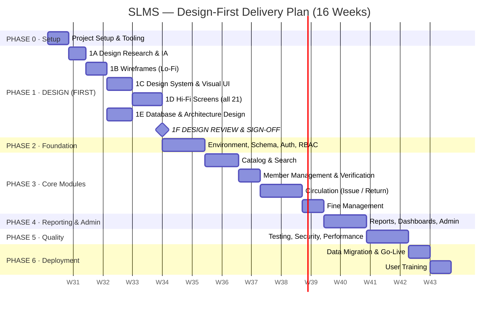

# Smart Library Management System (SLMS)
## Development Plan — Design-First Execution Roadmap

**Project:** Smart Library Management System, World University of Bangladesh
**Companion Document:** [SYSTEM_ARCHITECTURE.md](SYSTEM_ARCHITECTURE.md)
**Design Brief:** [DESIGN_PROMPT.txt](DESIGN_PROMPT.txt)
**Plan Version:** 1.0
**Baseline Schedule:** 16 weeks (aligned to the 6-month window in Feasibility Study §2.6)
**Approach:** **Design-first** — no production code is written until the UI/UX design and the data/architecture design are reviewed and signed off.

---

## 0. Plan at a Glance



| Phase | Weeks | Focus | Exit Gate |
|-------|-------|-------|-----------|
| **0** | 1 | Setup & tooling | Repo, board, environments ready |
| **1** | 2–5 | **DESIGN (first)** | 🚪 **Design sign-off — blocks all coding** |
| **2** | 6–7 | Foundation: schema, auth, RBAC, layout | Login works for all 4 roles |
| **3** | 8–13 | Core modules: catalog, search, members, circulation, fines | Full issue→return→fine cycle works |
| **4** | 14–15 | Reporting, dashboards, administration | All 9 reports render & export |
| **5** | 16–17 | Testing, security, performance, UAT | Zero critical defects |
| **6** | 18–19 | Migration, go-live, training | System in production use |

> Weeks 1–19 of calendar time compress into the report's 6-month window with buffer. The report's own estimate — requirements 2 wks, design 2 wks, development 8 wks, testing 2 wks, implementation 1 wk, training 1 wk — is preserved and expanded with explicit design and setup blocks.

---

## PHASE 0 — Project Setup *(Week 1)*

### Objectives
Establish the working environment before any design or code begins.

### Tasks

| # | Task | Output | Owner |
|---|------|--------|-------|
| 0.1 | Initialise Git repository, branch strategy (`main` / `develop` / `feature/*`) | Repo with `.gitignore`, README | Dev Lead |
| 0.2 | Set up issue board with the module breakdown from Architecture §7 | Kanban board, 8 epics | Dev Lead |
| 0.3 | Install local stack: PHP 8.2, Composer, MySQL 8, Node, VS Code | Working dev machines | All |
| 0.4 | Create Laravel 11 skeleton, configure `.env.example` | Bootable app | Dev Lead |
| 0.5 | Configure Postman workspace for API testing | Collection stub | QA |
| 0.6 | Agree coding standards (PSR-12), commit convention, PR review rule | `CONTRIBUTING.md` | All |
| 0.7 | Confirm hardware procurement status (scanners, printer, RAM/SSD upgrades) | Procurement checklist | PM |

### Deliverables
- ✅ Version-controlled repository
- ✅ Running local environment for every developer
- ✅ Project board populated with epics
- ✅ Coding standards agreed

### Exit Criteria
Every team member can clone, install, and serve the skeleton app locally.

---

## PHASE 1 — DESIGN *(Weeks 2–5)* 🎨
### **This phase comes first. No feature code is written until §1F sign-off.**

**Why design-first:** The report's requirement analysis (§1.10) identifies usability and error-reduction as the primary business justification. Building screens without a design system produces inconsistent, error-prone circulation flows — precisely the failure mode being replaced. Designing first also forces the data model to be validated against real screens before a single migration is written.

---

### 1A — Design Research & Information Architecture *(Week 2, days 1–4)*

| # | Task | Output |
|---|------|--------|
| 1A.1 | Re-read requirement analysis; extract every user goal per role | User goal matrix (3 roles × goals) |
| 1A.2 | Build user personas from stakeholder analysis (§1.3) | 4 personas: Student, Librarian, Admin, Management |
| 1A.3 | Map current manual workflow vs. proposed digital workflow | 2 journey maps (issue, return) |
| 1A.4 | Define information architecture & navigation model | IA sitemap, nav tree per role |
| 1A.5 | Inventory all 21 screens (Architecture §5.3.3) with purpose & priority | Screen inventory sheet |
| 1A.6 | Define the content model — what data each screen shows | Screen ↔ data mapping |
| 1A.7 | Study circulation-desk ergonomics: scanner flow, hands-free operation | Interaction constraints list |

**Deliverable:** *Design Research Pack* — personas, journey maps, IA sitemap, screen inventory.

**Key IA Decision — Navigation per role:**

```
STUDENT           LIBRARIAN                ADMINISTRATOR
├── Dashboard     ├── Dashboard            ├── Dashboard
├── Search Books  ├── Issue Book  ⚡        ├── Users & Roles
├── My Loans      ├── Return Book ⚡        ├── System Settings
├── My History    ├── Books                ├── Audit Log
├── My Fines      ├── Students             ├── Backup & Restore
└── Profile       ├── Overdue              ├── Reports (all)
                  ├── Fines                └── Profile
                  ├── Reports
                  └── Profile
                  ⚡ = scanner-primary screen
```

---

### 1B — Low-Fidelity Wireframes *(Week 2 day 5 – Week 3 day 4)*

| # | Task | Output |
|---|------|--------|
| 1B.1 | Wireframe the shell: sidebar, topbar, content area, responsive breakpoints | Layout wireframe |
| 1B.2 | Wireframe authentication (S-01) | 1 screen |
| 1B.3 | Wireframe student screens (S-02 → S-06) | 5 screens |
| 1B.4 | Wireframe circulation screens (S-07 → S-10) — **highest priority** | 4 screens |
| 1B.5 | Wireframe catalog & member screens (S-11 → S-15) | 5 screens |
| 1B.6 | Wireframe reports (S-16) | 5 screens |
| 1B.7 | Wireframe admin screens (S-17 → S-21) | 5 screens |
| 1B.8 | Wireframe all error/empty/loading states | State catalogue |
| 1B.9 | Paper-test the issue & return flows with a librarian | Feedback notes, revisions |

**Deliverable:** *Lo-Fi Wireframe Set* — 21 screens + states, greyscale, structure only.

**Critical wireframe — Issue Book (S-08), the highest-traffic screen:**

```
┌──────────────────────────────────────────────────────────────┐
│  ☰  SLMS · Issue Book                    🔔  Librarian ▾     │
├────────────┬─────────────────────────────────────────────────┤
│            │  ISSUE BOOK                                     │
│ Dashboard  │  ┌───────────────────────────────────────────┐  │
│ ▸ Issue    │  │ STEP 1 — SCAN STUDENT ID CARD             │  │
│   Return   │  │ ┌───────────────────────────────────────┐ │  │
│   Books    │  │ │ ▌  waiting for scan…            [⌨]  │ │  │
│   Students │  │ └───────────────────────────────────────┘ │  │
│   Overdue  │  │ ✓ 4018 · Sowmika Islam Suchi              │  │
│   Fines    │  │   CSE · Batch 66A                         │  │
│   Reports  │  │   Active loans 1/3   Fine due ৳0.00       │  │
│            │  │   ● ELIGIBLE TO BORROW                    │  │
│            │  └───────────────────────────────────────────┘  │
│            │  ┌───────────────────────────────────────────┐  │
│            │  │ STEP 2 — SCAN BOOK BARCODE                │  │
│            │  │ ┌───────────────────────────────────────┐ │  │
│            │  │ │ ▌  waiting for scan…            [⌨]  │ │  │
│            │  │ └───────────────────────────────────────┘ │  │
│            │  │ ✓ ACC-00231 · Database System Concepts    │  │
│            │  │   Silberschatz · Shelf C-14               │  │
│            │  │   ● AVAILABLE                             │  │
│            │  └───────────────────────────────────────────┘  │
│            │  ┌───────────────────────────────────────────┐  │
│            │  │ Issue date 30 Jul 2026                    │  │
│            │  │ Due date   13 Aug 2026  (14 days)         │  │
│            │  └───────────────────────────────────────────┘  │
│            │           [ Cancel ]   [ ✓ CONFIRM ISSUE ]      │
└────────────┴─────────────────────────────────────────────────┘
```

---

### 1C — Design System & Visual Language *(Week 3 day 5 – Week 4 day 3)*

| # | Task | Output |
|---|------|--------|
| 1C.1 | Define colour palette: brand, semantic status, neutrals; verify WCAG AA contrast | Colour tokens |
| 1C.2 | Define type scale, font family, weights, line heights | Typography tokens |
| 1C.3 | Define spacing scale (4/8 px base), radii, elevation | Layout tokens |
| 1C.4 | Design core components: button, input, select, table, card, badge, modal, alert, tabs, pagination | Component library |
| 1C.5 | Design the scanner-input component with all 4 states (idle / scanning / success / error) | Specialist component |
| 1C.6 | Define the status colour system (Available/Issued/Overdue/Lost) and apply consistently | Status spec |
| 1C.7 | Define icon set and usage rules | Icon library |
| 1C.8 | Define the print stylesheet for receipts and reports | Print spec |
| 1C.9 | Document accessibility rules: focus rings, keyboard order, ARIA, ≥44 px targets | A11y guide |

**Deliverable:** *SLMS Design System v1.0* — tokens, components, states, accessibility rules.

**Status colour system (used system-wide, never varied):**

| Status | Colour | Usage |
|--------|--------|-------|
| Available / Success / Eligible | Green | Copy available, on-time return, active member |
| Issued / Warning / Due Soon | Amber | Copy on loan, fine pending, due within 2 days |
| Overdue / Error / Blocked | Red | Past due date, blocked borrower, failed scan |
| Lost / Withdrawn / Inactive | Grey | Retired copy, inactive account |
| Informational / Neutral | Blue | Hints, counts, neutral notices |

---

### 1D — High-Fidelity Screen Design *(Week 4 day 4 – Week 5 day 3)*

| # | Task | Output |
|---|------|--------|
| 1D.1 | Apply the design system to all 21 wireframes | 21 hi-fi screens |
| 1D.2 | Design responsive variants: desktop 1366 px, tablet 768 px, mobile 375 px | 3 breakpoints per key screen |
| 1D.3 | Design all interaction states: hover, focus, active, disabled, loading, empty, error | State sheets |
| 1D.4 | Design the printable borrowing receipt | Print artefact |
| 1D.5 | Design each of the 9 report layouts for screen + print | Report designs |
| 1D.6 | Build a clickable prototype of the issue and return flows | Interactive prototype |
| 1D.7 | Write the redline/spec sheet handing measurements to developers | Dev handoff spec |

**Deliverable:** *Hi-Fi Design Pack* — all screens, all states, responsive, prototype, handoff spec.

---

### 1E — Database & Architecture Design *(Week 3 day 5 – Week 4 day 5, parallel with 1C/1D)*

| # | Task | Output |
|---|------|--------|
| 1E.1 | Finalise the ERD against the hi-fi screens — every displayed field must exist in the schema | Signed ERD |
| 1E.2 | Write the complete data dictionary (types, constraints, defaults) | Data dictionary |
| 1E.3 | Define the indexing strategy against the actual query patterns | Index plan |
| 1E.4 | Redraw DFD Level-0, Level-1, Level-2 as final design artefacts | 4 DFDs |
| 1E.5 | Define all service interfaces and their method signatures | Service contracts |
| 1E.6 | Define all repository interfaces | Repository contracts |
| 1E.7 | Write the Business Rules Register (BR-01 … BR-15) | Rules register |
| 1E.8 | Define the route table and API contract | Route/API spec |
| 1E.9 | Define the RBAC permission matrix | Permission matrix |
| 1E.10 | Record architectural decisions (ADR-01 … ADR-12) | ADR log |

**Deliverable:** *Technical Design Pack* — already captured in [SYSTEM_ARCHITECTURE.md](SYSTEM_ARCHITECTURE.md) §5–§12.

---

### 1F — 🚪 DESIGN REVIEW & SIGN-OFF GATE *(Week 5, days 4–5)*

**No implementation begins until every item below is checked.**

| ✔ | Sign-off Criterion |
|---|--------------------|
| ☐ All 21 screens designed at hi-fi, with every state |
| ☐ Design system documented; no screen uses an undefined token |
| ☐ Issue and Return flows prototyped and walked through with an actual librarian |
| ☐ Every screen's data need is satisfied by the ERD — no missing fields |
| ☐ Every functional requirement FR-01…FR-10 maps to at least one screen |
| ☐ Every screen maps to a controller and route |
| ☐ RBAC matrix reviewed — each role sees only what it should |
| ☐ All 15 business rules documented and located in a named service |
| ☐ Accessibility rules verified: contrast, focus, keyboard-only circulation |
| ☐ Print layouts (receipt + reports) designed |
| ☐ Responsive behaviour defined for 3 breakpoints |
| ☐ Supervisor / stakeholder approval recorded |

**Gate outcome:** Approved → Phase 2 begins. Rejected → revise and re-review within 3 days.

**Phase 1 Deliverables Summary**

| Artefact | Location |
|----------|----------|
| Design Research Pack | `docs/design/research/` |
| Lo-Fi Wireframes (21 screens) | `docs/design/wireframes/` |
| Design System v1.0 | `docs/design/system/` |
| Hi-Fi Screens + Prototype | `docs/design/hifi/` |
| ERD, DFDs, Data Dictionary | `docs/design/technical/` |
| Software Architecture Document | `SYSTEM_ARCHITECTURE.md` |
| Design Prompt Brief | `DESIGN_PROMPT.txt` |

---

## PHASE 2 — Foundation *(Weeks 6–7)*

### Objectives
Build the skeleton the whole system stands on: schema, authentication, RBAC, and the design-system-based layout.

| # | Task | Deliverable | Depends On |
|---|------|-------------|------------|
| 2.1 | Write all migrations in dependency order (roles → permissions → users → students → categories → books → book_copies → circulations → fines → settings → logs) | 11 migrations | 1E.1 |
| 2.2 | Add indexes and foreign-key constraints per the index plan | Migration additions | 1E.3 |
| 2.3 | Build all Eloquent models with relationships, casts, and scopes | 11 models | 2.1 |
| 2.4 | Write seeders: roles, permissions, role-permission map, admin user, categories, settings | 6 seeders | 2.3 |
| 2.5 | Write factories for testing | 5 factories | 2.3 |
| 2.6 | Implement `AuthenticationService` + `AuthController` + login screen | FR-01 working | 1D, 2.3 |
| 2.7 | Implement RBAC: `EnsureUserHasRole`, `EnsureUserHasPermission`, Policies | Middleware + policies | 2.4 |
| 2.8 | Implement `AuditLogService` and the `RecordAuditTrail` middleware | FR audit baseline | 2.3 |
| 2.9 | Implement `SettingService` reading `system_settings` | Config service | 2.4 |
| 2.10 | Convert the design system into Tailwind config + Blade components | Component library in code | 1C |
| 2.11 | Build layouts: `app`, `guest`, `print` + role-aware navigation | Shell working | 2.10 |
| 2.12 | Build the role-dispatched dashboard shell | S-02/S-07 shell | 2.11 |
| 2.13 | Implement error views 403 / 404 / 500 | Error pages | 2.10 |

**Exit Criteria**
- All four roles can log in and land on their own dashboard
- Unauthorised route access returns 403
- Every login and logout appears in `system_logs`
- Blade components visually match the design system

---

## PHASE 3 — Core Modules *(Weeks 8–13)*

### 3A — Catalog Management & Search *(Weeks 8–9)*

| # | Task | FR | Deliverable |
|---|------|----|-----------  |
| 3A.1 | `CategoryController` + category CRUD | FR-06 | Category management |
| 3A.2 | `BookCatalogService` + `BookRepository` | FR-06 | Service + repo |
| 3A.3 | `BookController` — index, create, store, edit, update, destroy | FR-06 | S-11, S-12 |
| 3A.4 | `BookCopyController` — add/withdraw copies, accession & barcode assignment | FR-06 | S-12 copies panel |
| 3A.5 | Enforce BR-10 (cannot delete a title with live copies) and BR-11 (uniqueness) | FR-06 | Rules enforced |
| 3A.6 | `BookSearchService` + result caching | FR-02 | Search service |
| 3A.7 | `BookSearchController` + search UI with filters | FR-02 | S-03 |
| 3A.8 | Book detail view with live availability | FR-02 | S-04 |
| 3A.9 | `/api/search/suggest` typeahead endpoint | FR-02 | JSON API |
| 3A.10 | CSV bulk-import tool for legacy catalog data | — | Import utility |

**Exit:** A librarian can add a book with 3 copies; a student finds it by title, author, ISBN, and category and sees "3 available".

---

### 3B — Member Management & ID Verification *(Week 10)*

| # | Task | FR | Deliverable |
|---|------|----|-----------  |
| 3B.1 | `StudentService` + `StudentRepository` | FR-07 | Service + repo |
| 3B.2 | `StudentController` full CRUD | FR-07 | S-13 |
| 3B.3 | Card-UID binding workflow (scan a card to register it to a student) | FR-10 | Binding UI |
| 3B.4 | `IdVerificationService` — resolve card → member, check eligibility | FR-10 | Verification service |
| 3B.5 | `/api/verify/card` JSON endpoint | FR-10 | Scanner API |
| 3B.6 | Student profile page: loans, history, fines | FR-07 | S-13 detail |
| 3B.7 | Suspend / reactivate membership | FR-07 | Status control |
| 3B.8 | CSV bulk-import for the student register | — | Import utility |

**Exit:** Scanning a student card returns the member's identity, eligibility, active loans, and outstanding fine in under 300 ms.

---

### 3C — Circulation *(Weeks 11–12)* ⭐ **Highest-risk, highest-value module**

| # | Task | FR | Deliverable |
|---|------|----|-----------  |
| 3C.1 | `CirculationRepository` + `BookCopyRepository` with `lockForUpdate` | — | Repos |
| 3C.2 | `BorrowService` implementing BR-01 … BR-05 inside one transaction | FR-03 | Issue logic |
| 3C.3 | Issue screen: two-step scan flow, live student/book panels | FR-03 | S-08 |
| 3C.4 | Printable borrowing receipt | FR-03 | S-10 |
| 3C.5 | `ReturnService` implementing BR-06 and BR-08 | FR-04 | Return logic |
| 3C.6 | Return screen with overdue detection and fine preview | FR-04 | S-09 |
| 3C.7 | `RenewalService` implementing BR-14 | FR-03 | Renewal action |
| 3C.8 | Student self-service: My Loans, My History | FR-03 | S-05 |
| 3C.9 | Overdue monitor with as-of-date filter | FR-05 | S-14 |
| 3C.10 | `SweepOverdueLoans` scheduled command (daily 00:05) | FR-05 | Cron job |
| 3C.11 | Concurrency test: two simultaneous issues of the same copy | — | Test proving BR-04 |

**Exit:** Complete cycle verified — scan card → scan book → issue → receipt prints → copy shows Issued → scan on return → status back to Available → counters correct.

---

### 3D — Fine Management *(Week 13)*

| # | Task | FR | Deliverable |
|---|------|----|-----------  |
| 3D.1 | `FineCalculationService` implementing BR-07 (grace, rate, cap) | FR-05 | Fine engine |
| 3D.2 | Hook fine creation into the return flow | FR-05 | Integration |
| 3D.3 | Accrual of fines on still-unreturned overdue loans | FR-05 | Daily accrual |
| 3D.4 | `FineController` — list, filter, view | FR-05 | S-15 |
| 3D.5 | `FineSettlementService` — full and partial collection | FR-05 | Collection |
| 3D.6 | Fine waiver (admin only, reason mandatory — BR-09) | FR-05 | Waiver flow |
| 3D.7 | Student self-service: My Fines | FR-05 | S-06 |
| 3D.8 | Borrow-block enforcement when outstanding fine exceeds the threshold (BR-03) | FR-05 | Rule wired |
| 3D.9 | Full fine test matrix (8 cases from Architecture §16.1) | FR-05 | Passing tests |

**Exit:** Every case in the fine test matrix passes; a blocked student is refused at the issue desk with a clear reason.

---

## PHASE 4 — Reporting & Administration *(Weeks 14–15)*

### 4A — Reporting *(Week 14)*

| # | Task | Deliverable |
|---|------|-------------|
| 4A.1 | `ReportingService` with strict read-only guarantee (BR-15) | Service |
| 4A.2 | Daily Circulation + Circulation Summary reports | 2 reports |
| 4A.3 | Overdue Books report | 1 report |
| 4A.4 | Fine Collection report | 1 report |
| 4A.5 | Book Inventory report | 1 report |
| 4A.6 | Most Borrowed Books report | 1 report |
| 4A.7 | Student Activity report | 1 report |
| 4A.8 | Department Usage report | 1 report |
| 4A.9 | System Audit report | 1 report |
| 4A.10 | PDF + Excel export for all reports | `ExportService` |
| 4A.11 | Role-based dashboards with cached KPI tiles | S-02, S-07 complete |
| 4A.12 | Management read-only reporting view | Management role |

### 4B — Administration *(Week 15)*

| # | Task | FR | Deliverable |
|---|------|----|-----------  |
| 4B.1 | `UserAccountService` + `UserController` CRUD | FR-09 | S-17 |
| 4B.2 | Enforce BR-13 (cannot remove the last admin) | FR-09 | Guard |
| 4B.3 | Password reset + forced-change flow | FR-09 | Security flow |
| 4B.4 | `RoleController` + permission matrix editor | FR-09 | S-18 |
| 4B.5 | `SettingController` — all policy values editable | FR-09 | S-19 |
| 4B.6 | Audit log viewer with filters and export | Security | S-20 |
| 4B.7 | `BackupService` — create, download, restore | FR-09 | S-21 |
| 4B.8 | `RunNightlyBackup` scheduled command (02:00) | FR-09 | Cron job |
| 4B.9 | `RecalculateCounters` reconciliation command | Reliability | Cron job |

**Exit:** An administrator can create a librarian account, change the fine rate and see it apply to new fines only, view the audit trail, and take + restore a backup.

---

## PHASE 5 — Quality Assurance *(Weeks 16–17)*

| # | Track | Tasks | Target |
|---|-------|-------|--------|
| 5.1 | **Unit tests** | Every service method; full fine matrix; all 15 business rules | ≥80% service coverage |
| 5.2 | **Integration tests** | Transactional integrity of issue/return; counter accuracy | All passing |
| 5.3 | **Feature tests** | Every route × every role (RBAC grid) | 100% route coverage |
| 5.4 | **Security testing** | SQLi in search, XSS in book titles, CSRF absence, IDOR on `/my/*`, brute-force lockout, privilege escalation | Zero high findings |
| 5.5 | **API testing** | Postman collection covering all 5 JSON endpoints incl. error paths | Collection green |
| 5.6 | **Performance testing** | Search with 10k titles; 50 concurrent circulation requests; report over 1 year of data | Meets §14.1 budgets |
| 5.7 | **Usability testing** | 3 librarians + 5 students perform scripted tasks | ≥90% task completion, no critical confusion |
| 5.8 | **Compatibility** | Chrome, Firefox, Edge; 1366×768, tablet, mobile | No layout breakage |
| 5.9 | **Accessibility** | Keyboard-only circulation; contrast audit; focus visibility | WCAG AA on core flows |
| 5.10 | **UAT** | Librarians run a full simulated day against staging | Formal acceptance |
| 5.11 | **Defect resolution** | Triage → fix → retest | 0 critical, 0 high open |

**Exit Criteria:** No critical or high-severity defects; performance budgets met; UAT signed off.

---

## PHASE 6 — Deployment & Training *(Weeks 18–19)*

### 6A — Data Migration & Go-Live *(Week 18)*

| # | Task | Deliverable |
|---|------|-------------|
| 6A.1 | Provision the production server (Windows/Linux, Apache/Nginx, PHP, MySQL) | Live server |
| 6A.2 | Harden: firewall, least-privilege DB user, TLS, security headers | Hardened host |
| 6A.3 | Clean and validate the legacy book catalog; import via CSV tool | Catalog loaded |
| 6A.4 | Import the student register; bind ID cards | Members loaded |
| 6A.5 | Enter currently-outstanding loans as opening balances | Open loans loaded |
| 6A.6 | Configure scanners and receipt printer on desk PCs | Hardware live |
| 6A.7 | Verify the nightly backup + restore cycle end-to-end | Backup proven |
| 6A.8 | Configure cron/scheduler for overdue sweep, backup, reconciliation | Jobs running |
| 6A.9 | Go-live with 1 week of parallel manual recording as a safety net | Production cutover |
| 6A.10 | Smoke-test every core flow in production | Go-live checklist signed |

### 6B — Training & Handover *(Week 19)*

| # | Task | Audience | Deliverable |
|---|------|----------|-------------|
| 6B.1 | Librarian training: issue, return, fines, catalog, reports | Librarians | 1 session + quick-reference card |
| 6B.2 | Administrator training: users, settings, logs, backup | Admin | 1 session + admin guide |
| 6B.3 | Student orientation: search, availability, loans, fines | Students | Poster + 1-page guide |
| 6B.4 | Write the User Manual | All | `docs/USER_MANUAL.md` |
| 6B.5 | Write the Technical/Maintenance Manual | CSE team | `docs/MAINTENANCE.md` |
| 6B.6 | Hand over the repository, credentials vault, and runbook | CSE team | Handover pack |
| 6B.7 | Agree the post-go-live support window (30 days) | PM | Support SLA |

---

## Resource & Cost Alignment

Mapped to Feasibility Study §2.4 (200,000 BDT initial · 50,000 BDT/year operational).

| Cost Item (from report) | Amount (BDT) | Consumed In |
|-------------------------|--------------|-------------|
| Software Development (design, coding, testing) | 80,000 | Phases 1–5 |
| Database Setup and Configuration | 15,000 | Phase 2, Phase 6A |
| Computer Upgrade (5 PCs — RAM, SSD) | 50,000 | Phase 0 procurement, Phase 6A |
| Barcode / Student ID Card Scanner (2 units) | 10,000 | Phase 0 procurement, Phase 6A |
| Network and Internet Improvement | 10,000 | Phase 6A |
| Staff Training and User Orientation | 15,000 | Phase 6B |
| System Documentation | 5,000 | Phases 1 & 6B |
| Contingency | 15,000 | Reserve |
| **Total Initial** | **200,000** | |

| Annual Operational | Amount (BDT) |
|--------------------|--------------|
| System Maintenance and Updates | 20,000 |
| Hardware Maintenance | 10,000 |
| Database Backup and Security | 5,000 |
| Technical Support | 15,000 |
| **Total Annual** | **50,000** |

**Payback:** Annual benefit 90,000 − annual cost 50,000 = **net 40,000 BDT/year**, against a 200,000 BDT build.

---

## Team & Responsibility Matrix

| Role | Phase 0 | Phase 1 (Design) | Phase 2 | Phase 3 | Phase 4 | Phase 5 | Phase 6 |
|------|:-------:|:----------------:|:-------:|:-------:|:-------:|:-------:|:-------:|
| Project Manager | A | A | C | C | C | A | A |
| UI/UX Designer | I | **R** | C | C | C | C | I |
| Backend Developer | R | C | **R** | **R** | **R** | R | R |
| Frontend Developer | R | C | **R** | **R** | R | R | I |
| Database Designer | C | **R** | **R** | C | C | C | R |
| QA / Tester | C | C | I | C | C | **R** | R |
| Librarian (stakeholder) | I | **C** | I | C | C | **C** | **C** |
| Supervisor | A | **A** | I | I | I | A | A |

*R = Responsible · A = Accountable · C = Consulted · I = Informed*

---

## Definition of Done

### Per Task
- [ ] Code follows PSR-12 and the agreed conventions
- [ ] Matches the approved hi-fi design for that screen
- [ ] Business rules live in a service, not in the controller or view
- [ ] Form Request validation present on every input
- [ ] Authorization enforced (middleware + policy)
- [ ] Write operations wrapped in a transaction and audit-logged
- [ ] Unit/feature test written and passing
- [ ] Peer-reviewed and merged to `develop`

### Per Phase
- [ ] All phase tasks complete
- [ ] Exit criteria demonstrably met
- [ ] Demo delivered to the supervisor/stakeholder
- [ ] Documentation updated
- [ ] Board reflects reality

### Per Release
- [ ] All tests green
- [ ] Zero critical/high defects
- [ ] Performance budgets met
- [ ] Security checklist passed
- [ ] Backup verified
- [ ] Rollback plan documented

---

## Risk Register (Plan-Level)

| # | Risk | Owner | Trigger | Response |
|---|------|-------|---------|----------|
| P-01 | Design phase overruns and squeezes development | PM | Week 5 gate not met | Timebox: descope non-core screens (Department Usage report, renewal flow) to Phase 2 backlog; never skip the gate for circulation screens |
| P-02 | Scanners not procured before Phase 3C | PM | Week 10 with no hardware | Manual-entry fallback is built into every scan field; scanner integration becomes a Phase 6A task |
| P-03 | Legacy catalog data is dirtier than expected | Data Lead | Import error rate >10% | Extend the Phase 6A cleansing window by 1 week using the contingency reserve; go live with a partial catalog and backfill |
| P-04 | Circulation module slips (highest complexity) | Dev Lead | Week 12 without a working issue flow | Circulation is scheduled before reporting precisely so it can absorb Phase 4 time; reporting descopes first |
| P-05 | Librarian availability for UAT | PM | No sessions booked by week 15 | Book UAT slots during Phase 1 design interviews; keep the same participants throughout |
| P-06 | Scope creep from stakeholders | PM | New feature requests mid-build | Out-of-scope list is contractual; all additions go to a Phase-2 backlog with a cost estimate |
| P-07 | Single-developer knowledge silo | Dev Lead | One person owns circulation | Mandatory peer review on all PRs; pair on the circulation transaction logic |

---

## Post-Launch Roadmap (Phase 2 Backlog)

| Priority | Feature | Rationale |
|:--------:|---------|-----------|
| High | Email/SMS due-date reminders | Directly reduces overdue rate and fine disputes |
| High | Book reservation / hold queue | Most-requested student feature after search |
| Medium | Online fine payment gateway | Removes cash handling at the desk |
| Medium | Native mobile app | Explicitly out of Phase-1 scope |
| Medium | E-book / digital resource catalog | Natural catalog extension |
| Low | Recommendation engine ("students also borrowed") | Report §3.5.1 mentions "related suggestions" |
| Low | University ERP / SIS integration | Removes duplicate student data entry |
| Low | Multi-branch / inter-library loan | Only if the university opens additional libraries |

---

**End of Development Plan**
