# Smart Library Management System (SLMS)
## System Development Document — MVC Model & Full Software Architecture

**Institution:** World University of Bangladesh — Department of Computer Science & Engineering
**Source Document:** *System Analysis and Design Report* (Chapters 1–3)
**Submitted By:** Sowmika Islam Suchi — Batch 66A, Student ID 4018
**Submitted To:** Md. Raihanul Haque, Lecturer
**Document Version:** 1.0
**Document Type:** Software Architecture Document (SAD) + MVC Design Specification

---

## Table of Contents

| # | Section |
|---|---------|
| 1 | [Introduction & Scope](#1-introduction--scope) |
| 2 | [Requirements Traceability Baseline](#2-requirements-traceability-baseline) |
| 3 | [Architectural Overview](#3-architectural-overview) |
| 4 | [Technology Stack Decision](#4-technology-stack-decision) |
| 5 | [The MVC Model — Detailed Specification](#5-the-mvc-model--detailed-specification) |
| 6 | [Layered Architecture (Extended MVC)](#6-layered-architecture-extended-mvc) |
| 7 | [Module Decomposition](#7-module-decomposition) |
| 8 | [Data Architecture & Data Dictionary](#8-data-architecture--data-dictionary) |
| 9 | [Data Flow Architecture (DFD Mapping)](#9-data-flow-architecture-dfd-mapping) |
| 10 | [Request Lifecycle & Sequence Design](#10-request-lifecycle--sequence-design) |
| 11 | [API & Routing Architecture](#11-api--routing-architecture) |
| 12 | [Security Architecture](#12-security-architecture) |
| 13 | [Deployment Architecture](#13-deployment-architecture) |
| 14 | [Non-Functional Architecture](#14-non-functional-architecture) |
| 15 | [Directory / Project Structure](#15-directory--project-structure) |
| 16 | [Testing Architecture](#16-testing-architecture) |
| 17 | [Architectural Decision Record (ADR) Log](#17-architectural-decision-record-adr-log) |
| 18 | [Risks & Mitigations](#18-risks--mitigations) |

---

## 1. Introduction & Scope

### 1.1 Purpose

This document translates the requirements and design analysis of the **Smart Library Management System (SLMS)** into an implementable software architecture built on the **Model–View–Controller (MVC)** architectural pattern. It is the engineering blueprint that bridges Chapter 3 (System Design / DFD) of the source report and the actual codebase.

### 1.2 System Objective

Automate the library operations of World University of Bangladesh — book catalog management, student registration and monitoring, borrowing and returning, fine calculation, and report generation — replacing a manual, paper-based workflow that suffers from slow record keeping, difficulty tracking borrowed books, fine calculation errors, and limited access to updated information.

### 1.3 In Scope

- Role-based authentication for Students, Librarians, and Administrators
- Book catalog CRUD, categorisation, shelf/location tracking, availability status
- Book search by title, author, ISBN, and category
- Student ID card verification (barcode/ID scanner integration)
- Book issue (borrow) and return workflows with barcode scanning
- Automated overdue fine calculation and fine ledger
- Report generation (circulation, overdue, inventory, fine collection, activity)
- User account management, system configuration, audit logging
- Database backup and recovery operations

### 1.4 Out of Scope (Phase 1)

- Online fee/fine payment gateway integration
- Native mobile applications (the web UI is responsive instead)
- E-book / digital content hosting and DRM
- Inter-library loan federation
- Integration with an external university ERP / student information system

### 1.5 Definitions

| Term | Meaning |
|------|---------|
| **SLMS** | Smart Library Management System |
| **MVC** | Model–View–Controller architectural pattern |
| **Circulation** | Any issue/return transaction of a physical book copy |
| **Copy** | A single physical instance of a title, identified by an accession number |
| **Title** | A bibliographic record (one ISBN may have many copies) |
| **Fine** | Monetary penalty accrued on an overdue circulation record |
| **Actor** | An external entity interacting with the system |

---

## 2. Requirements Traceability Baseline

### 2.1 Functional Requirements → Architectural Component

| Req ID | Functional Requirement | Controller | Service | Primary Model(s) |
|--------|------------------------|------------|---------|------------------|
| FR-01 | User Login and Authentication | `AuthController` | `AuthenticationService` | `User`, `Role`, `SystemLog` |
| FR-02 | Book Search | `BookSearchController` | `BookSearchService` | `Book`, `BookCopy`, `Category` |
| FR-03 | Book Borrowing | `CirculationController` | `BorrowService` | `Circulation`, `BookCopy`, `Student` |
| FR-04 | Book Returning | `CirculationController` | `ReturnService` | `Circulation`, `BookCopy`, `Fine` |
| FR-05 | Fine Calculation | `FineController` | `FineCalculationService` | `Fine`, `Circulation`, `SystemSetting` |
| FR-06 | Book Management | `BookController` | `BookCatalogService` | `Book`, `BookCopy`, `Category` |
| FR-07 | Student Management | `StudentController` | `StudentService` | `Student`, `User` |
| FR-08 | Report Generation | `ReportController` | `ReportingService` | *(read-only across all)* |
| FR-09 | User Account Management | `UserController` | `UserAccountService` | `User`, `Role`, `Permission` |
| FR-10 | Student ID Card Verification | `VerificationController` | `IdVerificationService` | `Student`, `SystemLog` |

### 2.2 Non-Functional Requirements → Architectural Tactic

| Category | Requirement (from report) | Architectural Tactic |
|----------|---------------------------|----------------------|
| **Performance** | Search results within a few seconds | DB indexing on `title`/`author`/`isbn`/`category_id`; server-side pagination; query result caching; eager loading to eliminate N+1 |
| **Security** | Authentication & authorization mechanisms | Session auth + bcrypt/Argon2 hashing, RBAC middleware, CSRF tokens, prepared statements, audit log |
| **Reliability** | Accurate and consistent data management | ACID transactions on circulation, DB-level FK constraints, optimistic locking on copy status, validated inputs |
| **Usability** | User-friendly, easy-to-use interface | Consistent design system, ≤3 clicks to any core task, scanner-first (keyboard-wedge) input, inline validation |
| **Availability** | Available during library operating hours | Local LAN-first deployment, DB replication/nightly dump, health-check endpoint, graceful degradation of search |
| **Scalability** | Accommodate future expansion | Stateless controllers, service layer isolation, repository abstraction, normalised schema, module boundaries |

### 2.3 Actors → System Roles

| Actor (Report) | System Role | Access Level |
|----------------|-------------|--------------|
| Student | `student` | Self-service: search, view availability, own history, own fines |
| Librarian | `librarian` | Circulation desk: books, issue/return, student records, operational reports |
| Library Administrator | `admin` | Full: users, settings, monitoring, backup, all reports |
| University Management | `management` | Read-only reporting dashboard |
| CS Engineering Team | *(ops, not an app role)* | Server/DB maintenance, deployment, updates |

---

## 3. Architectural Overview

> **Implementation note (v1.1).** The delivered system splits MVC across two deployables:
> a **React SPA** provides the View, and a **Laravel REST API** provides the Controller,
> Service, Repository and Model layers. See **ADR-13**. Everything below about layering,
> business-rule placement and data design is unchanged by that split — only the transport
> between View and Controller changed, from a Blade render to a JSON request.

### 3.1 Chosen Architectural Style

**Layered (N-tier) application implementing MVC**, delivered as a React single-page client
against a stateless Laravel REST API.

**Justification:**

1. **Fits the feasibility study.** The report budgets 200,000 BDT initial cost and a 6-month schedule with a small team. A modular monolith is the lowest-risk delivery for that envelope; microservices would blow both budget and schedule.
2. **Matches stated software requirements.** The report specifies MySQL, a web programming language, and HTML/CSS/JavaScript — precisely the MVC web stack.
3. **Single-site deployment.** One campus library, one LAN, hundreds (not millions) of users. Vertical scaling suffices.
4. **Maintainability by a student/CSE team.** MVC is the pattern the team is trained on, and separation of concerns keeps the code auditable for academic evaluation.
5. **Scalability preserved.** Module boundaries + service layer mean any module (e.g. Reporting) can later be extracted into its own service without rewriting the domain logic.

### 3.2 High-Level System Architecture

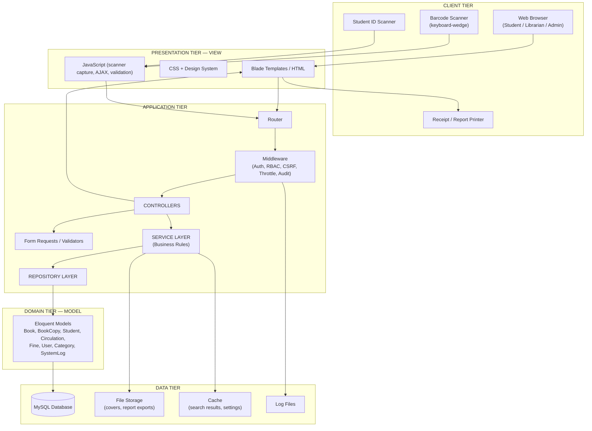

### 3.3 Architectural Principles

| # | Principle | Application in SLMS |
|---|-----------|---------------------|
| 1 | **Separation of Concerns** | Views never query the DB; Models never emit HTML; Controllers never contain business rules |
| 2 | **Single Responsibility** | One controller per functional area; one service per business capability |
| 3 | **Thin Controller, Fat Service** | Controllers only: validate → delegate → respond. All rules live in services |
| 4 | **Dependency Inversion** | Controllers depend on service interfaces; services depend on repository interfaces |
| 5 | **Don't Repeat Yourself** | Shared logic in services/traits/partials, never copy-pasted across controllers |
| 6 | **Fail Securely** | Deny-by-default authorization; every state change wrapped in a transaction |
| 7 | **Auditability** | Every write operation emits a `SystemLog` entry (satisfies Security Feasibility §2.10) |

---

## 4. Technology Stack Decision

The source report lists "PHP/Python/Java" as candidates. This architecture commits to a **PHP/Laravel** stack, with the equivalent mapping documented so the design remains portable.

### 4.1 Recommended Stack

| Layer | Technology | Version | Rationale |
|-------|-----------|---------|-----------|
| **Language** | PHP | 8.2+ | Listed in report; lowest hosting cost; largest local talent pool in BD |
| **Framework** | Laravel | 11.x | First-class MVC, built-in auth/RBAC, Eloquent ORM, migrations, validation, queues |
| **View Engine** | Blade | (bundled) | Server-rendered, component-based, layout inheritance |
| **CSS** | Tailwind CSS | 3.x | Utility-first design system, small production bundle |
| **JS** | Alpine.js + vanilla | 3.x | Lightweight interactivity; no SPA complexity |
| **Database** | MySQL | 8.0+ | Explicitly specified in report §1.8 |
| **Web Server** | Apache / Nginx | — | Standard on Windows/Linux per report §1.8 |
| **Auth** | Laravel Breeze + Policies | — | Session auth, password hashing, RBAC gates |
| **Reports/PDF** | DomPDF / Laravel Excel | — | Printable and downloadable reports (FR-08) |
| **Cache/Queue** | Redis *(optional)*, file driver default | — | Search cache, async report generation |
| **Testing** | PHPUnit + Pest | — | Unit + feature tests |
| **API Testing** | Postman | — | Explicitly listed in report §1.8 |
| **VCS** | Git | — | Explicitly listed in report §1.8 |
| **IDE** | VS Code | — | Explicitly listed in report §1.8 |

### 4.2 Portability Mapping

| Concept | Laravel (PHP) | Django (Python) | Spring Boot (Java) |
|---------|---------------|-----------------|--------------------|
| Controller | `App\Http\Controllers` | `views.py` | `@RestController` / `@Controller` |
| Model / ORM | Eloquent Model | Django Model | JPA `@Entity` |
| View | Blade | Django Template | Thymeleaf |
| Routing | `routes/web.php` | `urls.py` | `@RequestMapping` |
| Migration | Laravel Migrations | Django Migrations | Flyway / Liquibase |
| Validation | Form Request | Django Forms | Bean Validation (`@Valid`) |
| Middleware | Middleware | Middleware | Filter / Interceptor |
| Service Layer | `App\Services` | `services.py` | `@Service` |
| Repository | `App\Repositories` | Manager / QuerySet | `@Repository` |
| DI Container | Service Container | (manual) | Spring IoC |

> The architecture is framework-agnostic at the design level. Only §15 (directory structure) is Laravel-specific.

---

## 5. The MVC Model — Detailed Specification

### 5.1 MVC Concept Applied to SLMS

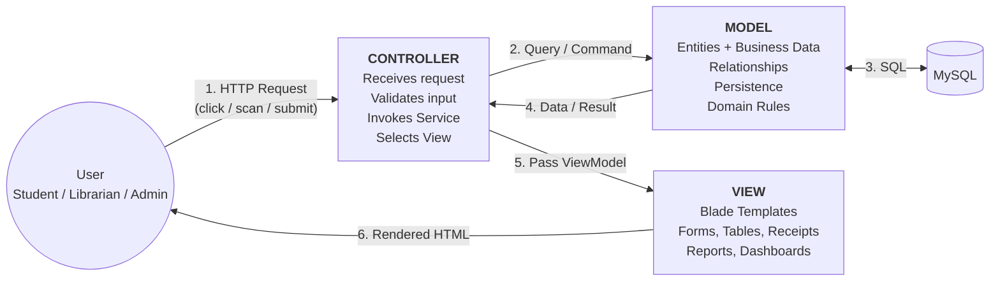

**Flow contract:**
1. The user acts (search, scan a card, submit a form). The **Router** maps the URI to a **Controller** action.
2. The Controller validates via a **Form Request**, then delegates to a **Service**.
3. The Service enforces business rules and calls **Repositories**, which operate on **Models**.
4. Models persist/retrieve through Eloquent to **MySQL**.
5. The Controller receives a result object and passes a **ViewModel** to a **View**.
6. The View renders HTML back to the user. The View never touches the database.

---

### 5.2 MODEL Layer

The Model layer holds the domain entities, their relationships, invariants, and persistence logic.

#### 5.2.1 Model Inventory

| Model | Table | Responsibility | Key Relationships |
|-------|-------|----------------|-------------------|
| `User` | `users` | Authentication identity for all roles | `belongsTo Role`, `hasOne Student`, `hasMany SystemLog` |
| `Role` | `roles` | RBAC role definition | `hasMany User`, `belongsToMany Permission` |
| `Permission` | `permissions` | Granular capability | `belongsToMany Role` |
| `Student` | `students` | Library member profile & eligibility | `belongsTo User`, `hasMany Circulation`, `hasMany Fine` |
| `Book` | `books` | Bibliographic title record | `belongsTo Category`, `hasMany BookCopy` |
| `BookCopy` | `book_copies` | Physical copy w/ accession no. & status | `belongsTo Book`, `hasMany Circulation` |
| `Category` | `categories` | Book classification | `hasMany Book` |
| `Circulation` | `circulations` | Issue/return transaction | `belongsTo Student`, `belongsTo BookCopy`, `hasOne Fine` |
| `Fine` | `fines` | Overdue penalty ledger | `belongsTo Circulation`, `belongsTo Student` |
| `SystemSetting` | `system_settings` | Configurable policy (loan period, fine rate) | — |
| `SystemLog` | `system_logs` | Immutable audit trail | `belongsTo User` |

#### 5.2.2 Domain Model — Entity Relationship

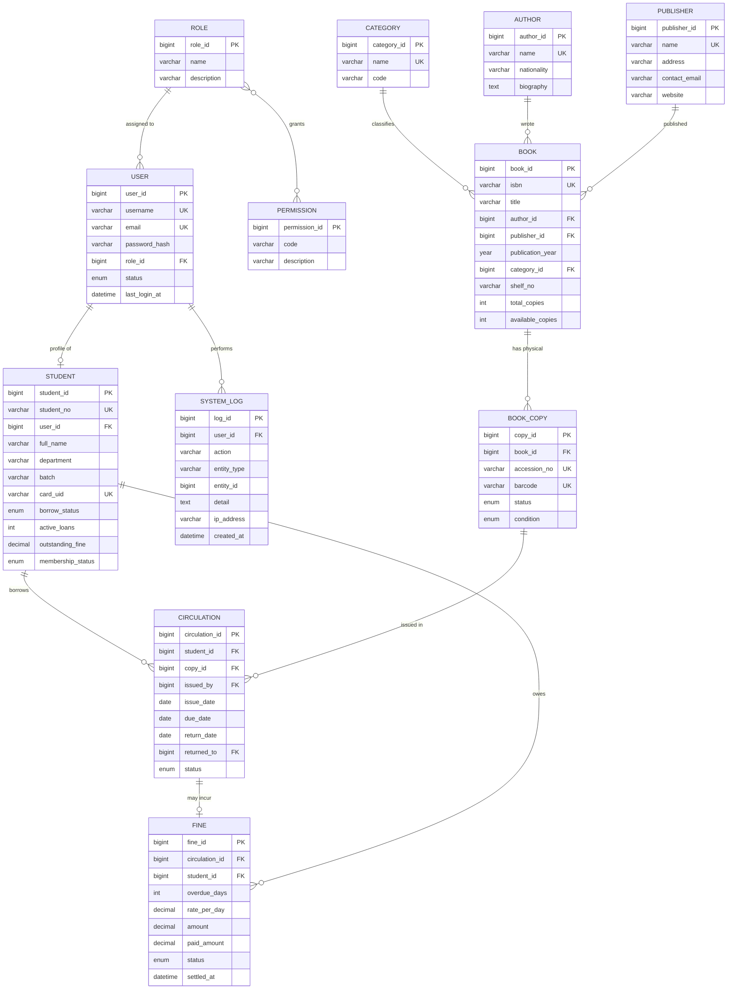

#### 5.2.3 Model Responsibilities — What Belongs Here

**Belongs in the Model:**
- Table/attribute mapping, casts, and fillable/guarded definitions
- Relationship declarations (`hasMany`, `belongsTo`, …)
- Query scopes (`scopeAvailable`, `scopeOverdue`, `scopeByCategory`)
- Accessors/mutators (`getIsOverdueAttribute`, `setIsbnAttribute`)
- Entity-local invariants (a `BookCopy` cannot move from `issued` → `issued`)
- Model events for audit hooks

**Does NOT belong in the Model:**
- HTTP request/response handling
- HTML or view formatting
- Cross-entity orchestration (that is the Service layer's job)
- Authorization decisions (that is Policy/Middleware)

#### 5.2.4 Representative Model Skeleton

```php
<?php

namespace App\Models;

use Illuminate\Database\Eloquent\Model;
use Illuminate\Database\Eloquent\Relations\BelongsTo;
use Illuminate\Database\Eloquent\Relations\HasOne;

class Circulation extends Model
{
    protected $primaryKey = 'circulation_id';

    protected $fillable = [
        'student_id', 'copy_id', 'issued_by',
        'issue_date', 'due_date', 'return_date',
        'returned_to', 'status',
    ];

    protected $casts = [
        'issue_date'  => 'date',
        'due_date'    => 'date',
        'return_date' => 'date',
    ];

    // ---- Relationships -------------------------------------------------
    public function student(): BelongsTo { return $this->belongsTo(Student::class, 'student_id'); }
    public function copy(): BelongsTo    { return $this->belongsTo(BookCopy::class, 'copy_id'); }
    public function fine(): HasOne       { return $this->hasOne(Fine::class, 'circulation_id'); }

    // ---- Scopes --------------------------------------------------------
    public function scopeActive($q)  { return $q->where('status', 'issued'); }
    public function scopeOverdue($q) { return $q->where('status', 'issued')->whereDate('due_date', '<', now()); }

    // ---- Domain accessors ----------------------------------------------
    public function getOverdueDaysAttribute(): int
    {
        $reference = $this->return_date ?? now();
        return $this->due_date->lt($reference)
            ? $this->due_date->diffInDays($reference)
            : 0;
    }

    public function getIsOverdueAttribute(): bool
    {
        return $this->overdue_days > 0;
    }
}
```

---

### 5.3 VIEW Layer

The View layer renders the interface. It is passive: it receives data and displays it.

> **As implemented (ADR-13):** the View is a React SPA in `frontend/`, not Blade templates.
> The hierarchy below is the delivered structure; the View *rules* in §5.3.2 apply
> unchanged — a React component must never contain a business rule, and never computes a
> fine, a due date or an eligibility decision. It renders what the API returns.
>
> ```
> frontend/src/
> ├── components/ui/       Button · Input · Card · Modal · StatusBadge · ScannerInput …
> ├── components/layout/   AppShell (sidebar + topbar + RBAC nav) · Toast
> ├── pages/auth/          LoginPage                                   (S-01)
> ├── pages/               DashboardPage — role-dispatched              (S-02, S-07)
> ├── pages/student/       Search · BookDetail · MyLoans · MyFines      (S-03…S-06)
> ├── pages/librarian/     IssueBook · ReturnBook · Receipt · Books ·
> │                        BookForm · Students · StudentDetail ·
> │                        Overdue · Fines                             (S-08…S-15)
> └── pages/admin/         Reports · Users+Roles · Settings · AuditLog  (S-16…S-20)
> ```

#### 5.3.1 View Hierarchy *(original Blade plan, retained for reference)*

```
resources/views/
├── layouts/
│   ├── app.blade.php              # Authenticated shell (sidebar + topbar)
│   ├── guest.blade.php            # Login / public catalog shell
│   └── print.blade.php            # Receipt & report print layout
├── components/
│   ├── data-table.blade.php       # Sortable, paginated table
│   ├── stat-card.blade.php        # Dashboard KPI tile
│   ├── scanner-input.blade.php    # Auto-focus barcode field
│   ├── alert.blade.php            # Success / error / warning banner
│   ├── modal.blade.php            # Confirmation dialogs
│   ├── badge.blade.php            # Status pill (Available / Issued / Overdue)
│   └── pagination.blade.php
├── auth/
│   ├── login.blade.php
│   └── change-password.blade.php
├── student/
│   ├── dashboard.blade.php
│   ├── search.blade.php
│   ├── book-detail.blade.php
│   ├── my-loans.blade.php
│   └── my-fines.blade.php
├── librarian/
│   ├── dashboard.blade.php
│   ├── issue.blade.php            # Scan card → scan book → confirm
│   ├── return.blade.php           # Scan book → show fine → confirm
│   └── overdue-list.blade.php
├── books/
│   ├── index.blade.php
│   ├── create.blade.php
│   ├── edit.blade.php
│   └── copies.blade.php
├── students/
│   ├── index.blade.php
│   ├── create.blade.php
│   └── show.blade.php
├── fines/
│   ├── index.blade.php
│   └── collect.blade.php
├── reports/
│   ├── index.blade.php
│   ├── circulation.blade.php
│   ├── overdue.blade.php
│   ├── inventory.blade.php
│   └── fine-collection.blade.php
├── admin/
│   ├── users.blade.php
│   ├── roles.blade.php
│   ├── settings.blade.php
│   ├── logs.blade.php
│   └── backup.blade.php
└── errors/
    ├── 403.blade.php
    ├── 404.blade.php
    └── 500.blade.php
```

#### 5.3.2 View Rules

| Rule | Statement |
|------|-----------|
| **V1** | A View must never execute a database query. All data arrives via the controller-supplied ViewModel. |
| **V2** | A View must never contain business rules. `@if($fine > 0)` is display logic and is allowed; *computing* the fine is not. |
| **V3** | All output must be escaped (`{{ }}`) unless deliberately raw and sanitised. |
| **V4** | Every state-changing form must include a CSRF token. |
| **V5** | Repeated markup becomes a Blade component, not a copy-paste. |
| **V6** | Every page must be usable at 1366×768 (the lab standard) and degrade gracefully to tablet width. |

#### 5.3.3 Screen Inventory

| # | Screen | Primary Actor | FR Covered |
|---|--------|---------------|------------|
| S-01 | Login | All | FR-01 |
| S-02 | Student Dashboard | Student | FR-02, FR-05 |
| S-03 | Book Search & Results | Student, Librarian | FR-02 |
| S-04 | Book Detail / Availability | Student | FR-02 |
| S-05 | My Loans / Borrowing History | Student | FR-03, FR-04 |
| S-06 | My Fines | Student | FR-05 |
| S-07 | Librarian Dashboard | Librarian | FR-08 |
| S-08 | Issue Book (scan flow) | Librarian | FR-03, FR-10 |
| S-09 | Return Book (scan flow) | Librarian | FR-04, FR-05 |
| S-10 | Borrowing Receipt (print) | Librarian | FR-03 |
| S-11 | Book List / Catalog Management | Librarian | FR-06 |
| S-12 | Add / Edit Book + Copies | Librarian | FR-06 |
| S-13 | Student List & Profile | Librarian | FR-07 |
| S-14 | Overdue Monitor | Librarian | FR-05, FR-08 |
| S-15 | Fine Collection | Librarian | FR-05 |
| S-16 | Reports Hub + 4 report views | Librarian, Admin, Management | FR-08 |
| S-17 | User Account Management | Admin | FR-09 |
| S-18 | Role & Permission Matrix | Admin | FR-09 |
| S-19 | System Settings | Admin | FR-09 |
| S-20 | Audit Log Viewer | Admin | Security §2.10 |
| S-21 | Backup & Restore | Admin | FR-09 |

---

### 5.4 CONTROLLER Layer

Controllers are the traffic directors. They are **thin** by contract.

#### 5.4.1 Controller Inventory

| Controller | Route Prefix | Actions | Guard |
|------------|--------------|---------|-------|
| `AuthController` | `/` | `showLogin`, `login`, `logout`, `changePassword` | guest / auth |
| `DashboardController` | `/dashboard` | `index` (role-dispatched) | auth |
| `BookSearchController` | `/search` | `index`, `results`, `show`, `suggest` | auth |
| `BookController` | `/books` | `index`, `create`, `store`, `edit`, `update`, `destroy` | librarian |
| `BookCopyController` | `/books/{book}/copies` | `index`, `store`, `update`, `destroy` | librarian |
| `CategoryController` | `/categories` | `index`, `store`, `update`, `destroy` | librarian |
| `StudentController` | `/students` | `index`, `create`, `store`, `show`, `edit`, `update`, `destroy` | librarian |
| `VerificationController` | `/verify` | `verifyCard`, `verifyStatus` | librarian |
| `CirculationController` | `/circulation` | `issueForm`, `issue`, `returnForm`, `return`, `history`, `receipt` | librarian |
| `MyLibraryController` | `/my` | `loans`, `history`, `fines` | student |
| `FineController` | `/fines` | `index`, `show`, `collect`, `waive` | librarian |
| `ReportController` | `/reports` | `index`, `circulation`, `overdue`, `inventory`, `fineCollection`, `export` | librarian/admin |
| `UserController` | `/admin/users` | `index`, `create`, `store`, `edit`, `update`, `toggleStatus`, `resetPassword` | admin |
| `RoleController` | `/admin/roles` | `index`, `store`, `update`, `syncPermissions` | admin |
| `SettingController` | `/admin/settings` | `index`, `update` | admin |
| `SystemLogController` | `/admin/logs` | `index`, `show`, `export` | admin |
| `BackupController` | `/admin/backup` | `index`, `create`, `download`, `restore` | admin |

#### 5.4.2 Controller Contract

```
A controller action MUST:
  1. Receive a validated Form Request (or call $request->validate()).
  2. Authorize via Policy / middleware.
  3. Delegate exactly one business operation to a Service.
  4. Return a View, a redirect, or a JSON response.

A controller action MUST NOT:
  - Contain if/else business rules (fine amounts, eligibility, loan limits).
  - Build raw SQL or call the query builder directly.
  - Exceed ~20 lines.
```

#### 5.4.3 Representative Controller

```php
<?php

namespace App\Http\Controllers;

use App\Http\Requests\IssueBookRequest;
use App\Services\Circulation\BorrowService;
use App\Exceptions\CirculationException;

class CirculationController extends Controller
{
    public function __construct(private BorrowService $borrowService) {}

    public function issueForm()
    {
        $this->authorize('circulate');
        return view('librarian.issue');
    }

    public function issue(IssueBookRequest $request)
    {
        $this->authorize('circulate');

        try {
            $circulation = $this->borrowService->issue(
                studentCardUid: $request->validated('card_uid'),
                bookBarcode:    $request->validated('barcode'),
                librarianId:    auth()->id(),
            );
        } catch (CirculationException $e) {
            return back()->withInput()->with('error', $e->getMessage());
        }

        return redirect()
            ->route('circulation.receipt', $circulation)
            ->with('success', 'Book issued successfully.');
    }
}
```

---

## 6. Layered Architecture (Extended MVC)

Plain MVC leaves an ambiguity: *where do multi-entity business rules live?* SLMS answers this with a **Service Layer** and a **Repository Layer** between Controller and Model.

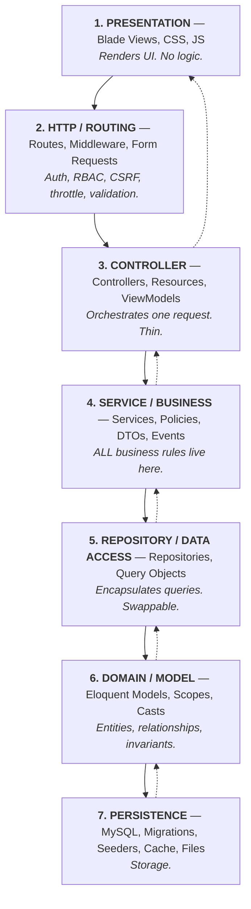

### 6.1 Layer Responsibility Matrix

| Layer | Knows About | Must Never |
|-------|-------------|------------|
| Presentation | ViewModel data shape | Query DB, hold business rules |
| HTTP/Routing | Request shape, roles | Contain domain logic |
| Controller | Services, ViewModels | Write SQL, compute fines |
| Service | Repositories, Models, other Services | Know about HTTP, sessions, or HTML |
| Repository | Models, query builder | Contain business rules |
| Model | Its own table + relations | Orchestrate other aggregates |
| Persistence | Schema, indexes | — |

### 6.2 Service Layer Inventory

| Service | Business Capability | Key Rules Enforced |
|---------|--------------------|--------------------|
| `AuthenticationService` | Login, logout, password lifecycle | Failed-attempt lockout, session regeneration, log every attempt |
| `IdVerificationService` | Student card → member resolution | Card active, membership valid, not blacklisted |
| `BookSearchService` | Search & filter catalog | Query sanitisation, relevance ordering, cache 60 s |
| `BookCatalogService` | Book & copy CRUD | ISBN uniqueness, cannot delete a title with issued copies |
| `StudentService` | Member lifecycle | Unique student no., card UID uniqueness, suspension rules |
| `BorrowService` | Issue a book | Eligibility, loan-limit, availability, outstanding-fine block, due date calc |
| `ReturnService` | Return a book | Record match, overdue detection, triggers fine, restores availability |
| `FineCalculationService` | Compute & persist fines | `days_overdue × rate`, grace period, ceiling cap |
| `FineSettlementService` | Collect / waive fines | Waive requires admin, partial payment ledger |
| `ReportingService` | Build all reports | Date-range validation, aggregation, export formatting |
| `UserAccountService` | Accounts & roles | Cannot delete last admin, forced password reset |
| `AuditLogService` | Write audit trail | Append-only, never updated or deleted |
| `BackupService` | DB dump / restore | Admin-only, timestamped, integrity check |

### 6.3 Representative Service — Business Rules Isolated

```php
<?php

namespace App\Services\Circulation;

use App\Exceptions\CirculationException;
use App\Models\Circulation;
use App\Repositories\{StudentRepository, BookCopyRepository, CirculationRepository};
use App\Services\{IdVerificationService, AuditLogService, SettingService};
use Illuminate\Support\Facades\DB;

class BorrowService
{
    public function __construct(
        private StudentRepository     $students,
        private BookCopyRepository    $copies,
        private CirculationRepository $circulations,
        private IdVerificationService $verifier,
        private SettingService        $settings,
        private AuditLogService       $audit,
    ) {}

    public function issue(string $studentCardUid, string $bookBarcode, int $librarianId): Circulation
    {
        return DB::transaction(function () use ($studentCardUid, $bookBarcode, $librarianId) {

            // FR-10 — Student ID card verification
            $student = $this->verifier->resolveByCard($studentCardUid);

            // Business Rule BR-01 — membership must be active
            if (! $student->isActiveMember()) {
                throw new CirculationException('Student membership is inactive or suspended.');
            }

            // Business Rule BR-02 — loan limit
            $limit = $this->settings->int('max_books_per_student', 3);
            if ($this->circulations->activeCountFor($student->student_id) >= $limit) {
                throw new CirculationException("Loan limit reached ({$limit} books).");
            }

            // Business Rule BR-03 — outstanding fine block
            $threshold = $this->settings->decimal('fine_block_threshold', 100.00);
            if ($student->outstanding_fine > $threshold) {
                throw new CirculationException('Outstanding fine exceeds the allowed limit.');
            }

            // Business Rule BR-04 — copy must be available (row lock prevents double-issue)
            $copy = $this->copies->lockForUpdateByBarcode($bookBarcode);
            if (! $copy || $copy->status !== 'available') {
                throw new CirculationException('This book copy is not available for issue.');
            }

            // Business Rule BR-05 — due date from configurable loan period
            $loanDays = $this->settings->int('loan_period_days', 14);

            $circulation = $this->circulations->create([
                'student_id' => $student->student_id,
                'copy_id'    => $copy->copy_id,
                'issued_by'  => $librarianId,
                'issue_date' => now()->toDateString(),
                'due_date'   => now()->addDays($loanDays)->toDateString(),
                'status'     => 'issued',
            ]);

            $this->copies->markIssued($copy);
            $this->students->incrementActiveLoans($student);

            $this->audit->record($librarianId, 'BOOK_ISSUED', 'circulation', $circulation->circulation_id,
                "Copy {$copy->accession_no} issued to {$student->student_no}, due {$circulation->due_date}");

            return $circulation;
        });
    }
}
```

### 6.4 Repository Layer

```php
<?php

namespace App\Repositories\Contracts;

use App\Models\BookCopy;

interface BookCopyRepositoryInterface
{
    public function findByBarcode(string $barcode): ?BookCopy;
    public function lockForUpdateByBarcode(string $barcode): ?BookCopy;
    public function markIssued(BookCopy $copy): void;
    public function markAvailable(BookCopy $copy): void;
    public function availableCountForBook(int $bookId): int;
}
```

Binding the interface to the concrete Eloquent implementation in a service provider keeps the Service layer testable with in-memory fakes and allows the storage engine to change without touching business logic.

---

## 7. Module Decomposition

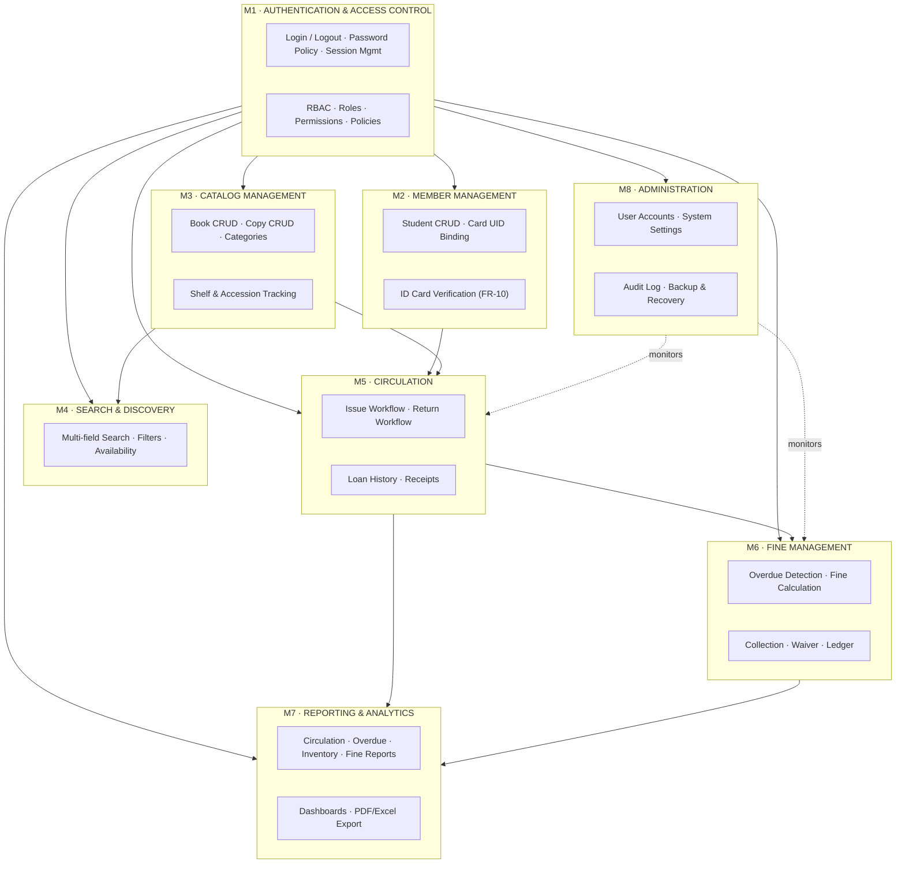

### 7.1 Module Dependency Rules

| Rule | Statement |
|------|-----------|
| **D1** | M1 (Auth) is depended upon by all; it depends on none. |
| **D2** | M5 (Circulation) is the transactional core — it may call M2, M3, M6. |
| **D3** | M7 (Reporting) is **read-only**. It must never mutate state. |
| **D4** | M8 (Admin) observes all modules via `SystemLog`; it does not embed their logic. |
| **D5** | No circular dependencies. If two modules need each other, extract a shared service. |

---

## 8. Data Architecture & Data Dictionary

### 8.1 Logical Data Stores (mapped from report §3.4)

| Report Data Store | Physical Tables |
|-------------------|-----------------|
| Student Database | `students`, `users`, `roles`, `permissions` |
| Book Database | `books`, `book_copies`, `categories`, `authors`, `publishers` |
| *List of Authors* (DFD L-1) | `authors` |
| Circulation / Transaction Database | `circulations` |
| Fine Database | `fines` |
| System Log Database | `system_logs`, `system_settings` |

### 8.2 Data Dictionary

#### Table: `users`
| Column | Type | Constraint | Description |
|--------|------|-----------|-------------|
| `user_id` | BIGINT UNSIGNED | PK, AUTO_INCREMENT | Surrogate key |
| `username` | VARCHAR(50) | UNIQUE, NOT NULL | Login identifier |
| `email` | VARCHAR(120) | UNIQUE, NOT NULL | Contact / recovery |
| `password_hash` | VARCHAR(255) | NOT NULL | Bcrypt/Argon2 hash — never plaintext |
| `role_id` | BIGINT UNSIGNED | FK → `roles.role_id` | RBAC role |
| `status` | ENUM('active','inactive','locked') | DEFAULT 'active' | Account state |
| `failed_attempts` | TINYINT UNSIGNED | DEFAULT 0 | Lockout counter |
| `last_login_at` | DATETIME | NULL | Last successful login |
| `created_at` / `updated_at` | TIMESTAMP | | Audit timestamps |

#### Table: `roles`
| Column | Type | Constraint | Description |
|--------|------|-----------|-------------|
| `role_id` | BIGINT UNSIGNED | PK | |
| `name` | VARCHAR(30) | UNIQUE | `student`, `librarian`, `admin`, `management` |
| `description` | VARCHAR(150) | | Human-readable purpose |

#### Table: `permissions`
| Column | Type | Constraint | Description |
|--------|------|-----------|-------------|
| `permission_id` | BIGINT UNSIGNED | PK | |
| `code` | VARCHAR(60) | UNIQUE | e.g. `book.create`, `circulate`, `fine.waive` |
| `description` | VARCHAR(150) | | |

#### Table: `role_permission` (pivot)
| Column | Type | Constraint |
|--------|------|-----------|
| `role_id` | BIGINT UNSIGNED | FK → `roles`, PK(composite) |
| `permission_id` | BIGINT UNSIGNED | FK → `permissions`, PK(composite) |

#### Table: `students`
| Column | Type | Constraint | Description |
|--------|------|-----------|-------------|
| `student_id` | BIGINT UNSIGNED | PK | |
| `student_no` | VARCHAR(20) | UNIQUE, NOT NULL | University roll (e.g. `4018`) |
| `user_id` | BIGINT UNSIGNED | FK → `users`, NULL | Linked login account |
| `full_name` | VARCHAR(120) | NOT NULL | |
| `department` | VARCHAR(80) | NOT NULL | e.g. CSE |
| `batch` | VARCHAR(20) | | e.g. `66A` |
| `email` | VARCHAR(120) | | |
| `phone` | VARCHAR(20) | | |
| `card_uid` | VARCHAR(64) | UNIQUE | Scanned ID-card identifier (FR-10) |
| `membership_status` | ENUM('active','suspended','expired') | DEFAULT 'active' | |
| `borrow_status` | ENUM('eligible','blocked') | DEFAULT 'eligible' | Derived from fines/limits |
| `active_loans` | TINYINT UNSIGNED | DEFAULT 0 | Denormalised counter |
| `outstanding_fine` | DECIMAL(10,2) | DEFAULT 0.00 | Denormalised balance |
| `enrolled_on` | DATE | | Membership start |

#### Table: `categories`
| Column | Type | Constraint | Description |
|--------|------|-----------|-------------|
| `category_id` | BIGINT UNSIGNED | PK | |
| `name` | VARCHAR(80) | UNIQUE | e.g. Computer Science |
| `code` | VARCHAR(20) | UNIQUE | Classification code |
| `description` | VARCHAR(200) | | |

#### Table: `books`
| Column | Type | Constraint | Description |
|--------|------|-----------|-------------|
| `book_id` | BIGINT UNSIGNED | PK | |
| `isbn` | VARCHAR(20) | UNIQUE, NOT NULL | International Standard Book Number |
| `title` | VARCHAR(200) | NOT NULL, INDEX | Book title |
| `author` | VARCHAR(150) | NOT NULL, INDEX | Author name |
| `publisher` | VARCHAR(120) | | |
| `publication_year` | YEAR | | |
| `edition` | VARCHAR(30) | | |
| `category_id` | BIGINT UNSIGNED | FK → `categories`, INDEX | |
| `shelf_no` | VARCHAR(30) | | Physical shelf location |
| `language` | VARCHAR(30) | DEFAULT 'English' | |
| `total_copies` | SMALLINT UNSIGNED | DEFAULT 0 | Maintained by trigger/service |
| `available_copies` | SMALLINT UNSIGNED | DEFAULT 0 | Real-time availability |
| `cover_image` | VARCHAR(255) | NULL | Stored file path |

*Composite index:* `idx_book_search (title, author)` · *Fulltext (optional):* `ft_book (title, author, publisher)`

#### Table: `book_copies`
| Column | Type | Constraint | Description |
|--------|------|-----------|-------------|
| `copy_id` | BIGINT UNSIGNED | PK | |
| `book_id` | BIGINT UNSIGNED | FK → `books`, INDEX | Parent title |
| `accession_no` | VARCHAR(30) | UNIQUE, NOT NULL | Library accession number |
| `barcode` | VARCHAR(64) | UNIQUE, NOT NULL, INDEX | Scanned at circulation desk |
| `status` | ENUM('available','issued','reserved','lost','damaged','withdrawn') | DEFAULT 'available' | |
| `condition` | ENUM('new','good','fair','poor') | DEFAULT 'good' | |
| `acquired_on` | DATE | | |

#### Table: `circulations`
| Column | Type | Constraint | Description |
|--------|------|-----------|-------------|
| `circulation_id` | BIGINT UNSIGNED | PK | |
| `student_id` | BIGINT UNSIGNED | FK → `students`, INDEX | Borrower |
| `copy_id` | BIGINT UNSIGNED | FK → `book_copies`, INDEX | Physical copy |
| `issued_by` | BIGINT UNSIGNED | FK → `users` | Librarian who issued |
| `issue_date` | DATE | NOT NULL | |
| `due_date` | DATE | NOT NULL, INDEX | `issue_date + loan_period_days` |
| `return_date` | DATE | NULL | NULL while outstanding |
| `returned_to` | BIGINT UNSIGNED | FK → `users`, NULL | Librarian who received |
| `renewal_count` | TINYINT UNSIGNED | DEFAULT 0 | Times renewed |
| `status` | ENUM('issued','returned','overdue','lost') | DEFAULT 'issued', INDEX | |

*Composite index:* `idx_active_loans (student_id, status)`

#### Table: `fines`
| Column | Type | Constraint | Description |
|--------|------|-----------|-------------|
| `fine_id` | BIGINT UNSIGNED | PK | |
| `circulation_id` | BIGINT UNSIGNED | FK → `circulations`, UNIQUE | Source transaction |
| `student_id` | BIGINT UNSIGNED | FK → `students`, INDEX | Debtor |
| `overdue_days` | SMALLINT UNSIGNED | NOT NULL | Days past due |
| `rate_per_day` | DECIMAL(6,2) | NOT NULL | Snapshot of policy rate |
| `amount` | DECIMAL(10,2) | NOT NULL | `overdue_days × rate_per_day` (capped) |
| `paid_amount` | DECIMAL(10,2) | DEFAULT 0.00 | Supports partial payment |
| `status` | ENUM('pending','partial','paid','waived') | DEFAULT 'pending', INDEX | |
| `waived_by` | BIGINT UNSIGNED | FK → `users`, NULL | Admin who waived |
| `waive_reason` | VARCHAR(200) | NULL | Required if waived |
| `settled_at` | DATETIME | NULL | |

#### Table: `system_settings`
| Column | Type | Constraint | Description |
|--------|------|-----------|-------------|
| `setting_id` | BIGINT UNSIGNED | PK | |
| `key` | VARCHAR(60) | UNIQUE | e.g. `loan_period_days` |
| `value` | VARCHAR(255) | | |
| `type` | ENUM('int','decimal','string','bool') | | Cast hint |
| `description` | VARCHAR(200) | | |

**Seeded policy values:**

| Key | Default | Meaning |
|-----|---------|---------|
| `loan_period_days` | `14` | Standard loan duration |
| `max_books_per_student` | `3` | Concurrent loan limit |
| `fine_rate_per_day` | `5.00` | BDT per overdue day |
| `fine_grace_days` | `0` | Grace period before fines start |
| `fine_max_cap` | `500.00` | Ceiling per transaction |
| `fine_block_threshold` | `100.00` | Outstanding fine that blocks borrowing |
| `max_renewals` | `1` | Renewals allowed per loan |
| `library_open_time` / `library_close_time` | `08:00` / `20:00` | Availability window |

#### Table: `system_logs`
| Column | Type | Constraint | Description |
|--------|------|-----------|-------------|
| `log_id` | BIGINT UNSIGNED | PK | |
| `user_id` | BIGINT UNSIGNED | FK → `users`, NULL, INDEX | Actor (NULL for system jobs) |
| `action` | VARCHAR(60) | NOT NULL, INDEX | e.g. `BOOK_ISSUED`, `LOGIN_FAILED` |
| `entity_type` | VARCHAR(40) | | Affected model |
| `entity_id` | BIGINT UNSIGNED | NULL | Affected record |
| `detail` | TEXT | | Human-readable summary |
| `ip_address` | VARCHAR(45) | | IPv4/IPv6 |
| `user_agent` | VARCHAR(255) | | |
| `created_at` | DATETIME | INDEX | Append-only; never updated |

### 8.3 Referential Integrity Policy

| Relationship | On Delete | Rationale |
|--------------|-----------|-----------|
| `books` → `book_copies` | `RESTRICT` | Cannot delete a title that still has physical copies |
| `book_copies` → `circulations` | `RESTRICT` | Preserve circulation history |
| `students` → `circulations` | `RESTRICT` | Preserve borrowing history |
| `circulations` → `fines` | `CASCADE` | A fine has no meaning without its transaction |
| `users` → `system_logs` | `SET NULL` | Logs survive account deletion (audit integrity) |
| `roles` → `users` | `RESTRICT` | Cannot delete a role still in use |

### 8.4 Indexing Strategy (Performance NFR)

| Index | Table | Columns | Serves |
|-------|-------|---------|--------|
| `idx_book_title` | `books` | `title` | FR-02 title search |
| `idx_book_author` | `books` | `author` | FR-02 author search |
| `uq_book_isbn` | `books` | `isbn` | FR-02 ISBN lookup, uniqueness |
| `idx_book_category` | `books` | `category_id` | Category filter |
| `uq_copy_barcode` | `book_copies` | `barcode` | Circulation scan (O(1)) |
| `idx_copy_status` | `book_copies` | `book_id, status` | Availability count |
| `uq_student_card` | `students` | `card_uid` | FR-10 card scan |
| `idx_circ_active` | `circulations` | `student_id, status` | Active-loan count |
| `idx_circ_due` | `circulations` | `due_date, status` | Overdue sweep job |
| `idx_fine_status` | `fines` | `student_id, status` | Outstanding balance |
| `idx_log_time` | `system_logs` | `created_at` | Audit viewer |

---

## 9. Data Flow Architecture (DFD Mapping)

### 9.1 DFD Level-0 → Architecture

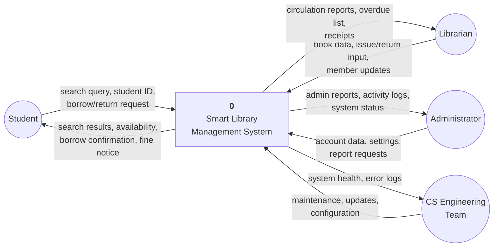

### 9.2 DFD Level-1 → Controllers & Data Stores

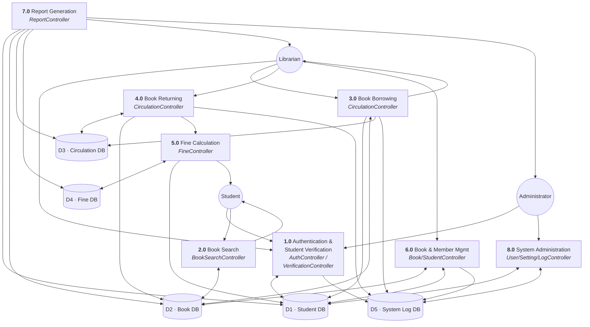

### 9.3 DFD Level-2 → Book Search Workflow (report §3.5.1)

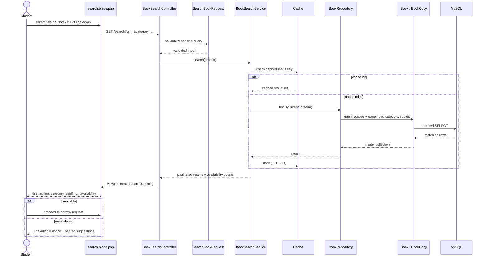

### 9.4 DFD Level-2 → Borrow & Return Workflow (report §3.5.2)

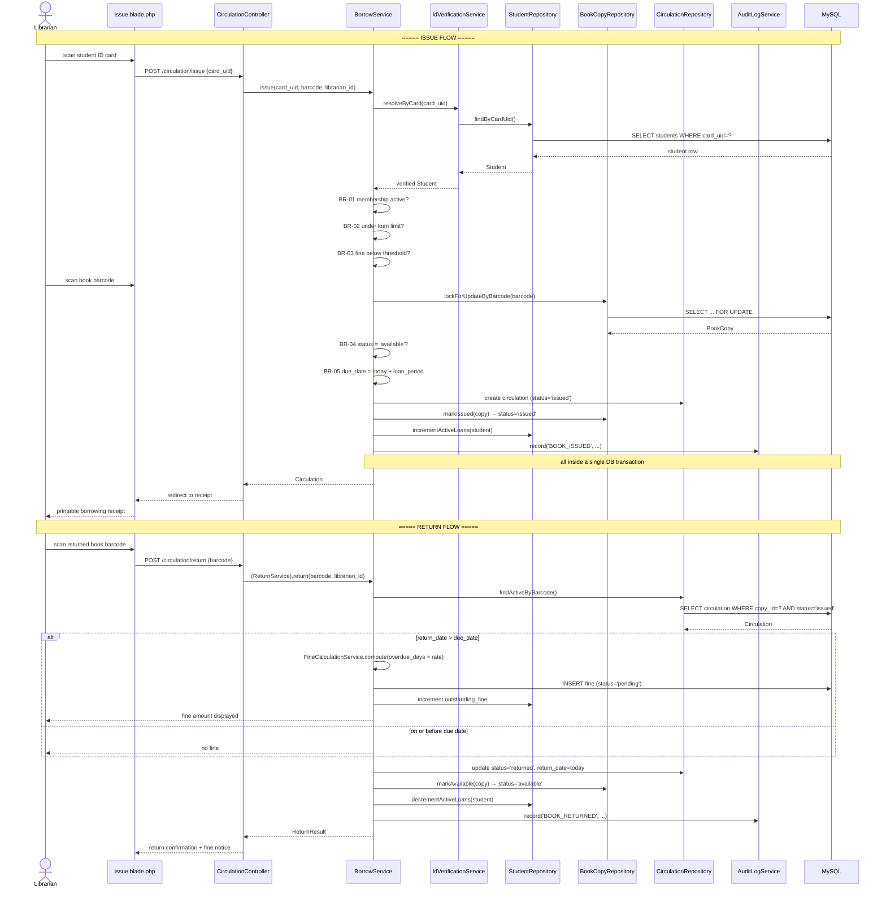

---

## 10. Request Lifecycle & Sequence Design

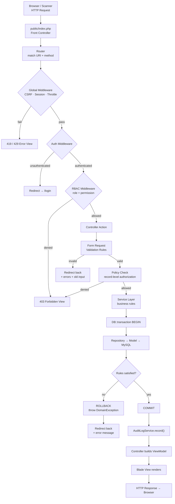

---

## 11. API & Routing Architecture

### 11.1 Web Routes (server-rendered)

| Method | URI | Controller@action | Middleware | FR |
|--------|-----|-------------------|------------|-----|
| GET | `/login` | `AuthController@showLogin` | `guest` | FR-01 |
| POST | `/login` | `AuthController@login` | `guest`, `throttle:5,1` | FR-01 |
| POST | `/logout` | `AuthController@logout` | `auth` | FR-01 |
| GET | `/dashboard` | `DashboardController@index` | `auth` | — |
| GET | `/search` | `BookSearchController@index` | `auth` | FR-02 |
| GET | `/search/results` | `BookSearchController@results` | `auth` | FR-02 |
| GET | `/books/{book}` | `BookSearchController@show` | `auth` | FR-02 |
| GET | `/my/loans` | `MyLibraryController@loans` | `auth`, `role:student` | FR-03 |
| GET | `/my/history` | `MyLibraryController@history` | `auth`, `role:student` | FR-03 |
| GET | `/my/fines` | `MyLibraryController@fines` | `auth`, `role:student` | FR-05 |
| GET | `/circulation/issue` | `CirculationController@issueForm` | `auth`, `perm:circulate` | FR-03 |
| POST | `/circulation/issue` | `CirculationController@issue` | `auth`, `perm:circulate` | FR-03, FR-10 |
| GET | `/circulation/return` | `CirculationController@returnForm` | `auth`, `perm:circulate` | FR-04 |
| POST | `/circulation/return` | `CirculationController@return` | `auth`, `perm:circulate` | FR-04, FR-05 |
| GET | `/circulation/{id}/receipt` | `CirculationController@receipt` | `auth`, `perm:circulate` | FR-03 |
| GET/POST | `/books` | `BookController@index/store` | `auth`, `perm:book.manage` | FR-06 |
| GET/PUT/DELETE | `/books/{book}` | `BookController@edit/update/destroy` | `auth`, `perm:book.manage` | FR-06 |
| RESOURCE | `/students` | `StudentController` | `auth`, `perm:student.manage` | FR-07 |
| GET | `/fines` | `FineController@index` | `auth`, `perm:fine.manage` | FR-05 |
| POST | `/fines/{fine}/collect` | `FineController@collect` | `auth`, `perm:fine.manage` | FR-05 |
| POST | `/fines/{fine}/waive` | `FineController@waive` | `auth`, `role:admin` | FR-05 |
| GET | `/reports` | `ReportController@index` | `auth`, `perm:report.view` | FR-08 |
| GET | `/reports/{type}` | `ReportController@{type}` | `auth`, `perm:report.view` | FR-08 |
| GET | `/reports/{type}/export` | `ReportController@export` | `auth`, `perm:report.view` | FR-08 |
| RESOURCE | `/admin/users` | `UserController` | `auth`, `role:admin` | FR-09 |
| GET/PUT | `/admin/settings` | `SettingController@index/update` | `auth`, `role:admin` | FR-09 |
| GET | `/admin/logs` | `SystemLogController@index` | `auth`, `role:admin` | Sec. |
| POST | `/admin/backup` | `BackupController@create` | `auth`, `role:admin` | FR-09 |

### 11.2 JSON Endpoints (scanner / AJAX)

| Method | URI | Purpose | Response |
|--------|-----|---------|----------|
| POST | `/api/verify/card` | Resolve scanned student card | `{ok, student:{no,name,dept,eligible,active_loans,outstanding_fine}}` |
| GET | `/api/books/lookup/{barcode}` | Resolve scanned book barcode | `{ok, copy:{accession,title,author,status}}` |
| GET | `/api/search/suggest?q=` | Typeahead suggestions | `{suggestions:[…]}` |
| GET | `/api/books/{book}/availability` | Live availability count | `{total, available}` |
| GET | `/api/dashboard/stats` | Dashboard KPI refresh | `{issued_today, returned_today, overdue, fines_pending}` |

**Standard response envelope:**

```json
{
  "ok": true,
  "data": {},
  "message": "Human-readable status",
  "errors": {}
}
```

**HTTP status contract:** `200` success · `201` created · `400` bad request · `401` unauthenticated · `403` forbidden · `404` not found · `409` business-rule conflict (e.g. copy already issued) · `422` validation failed · `429` rate-limited · `500` server error.

---

## 12. Security Architecture

Directly implements Security Feasibility (report §2.10) and NFR "Security".

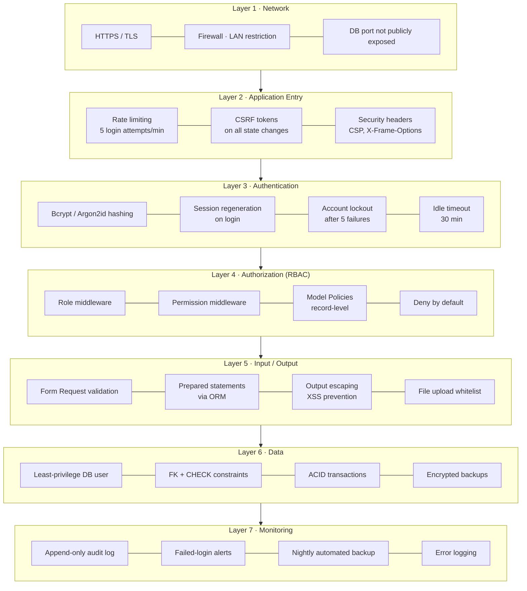

### 12.1 Role–Permission Matrix

| Permission | Student | Librarian | Admin | Management |
|------------|:-------:|:---------:|:-----:|:----------:|
| `book.search` | ✅ | ✅ | ✅ | ✅ |
| `book.view` | ✅ | ✅ | ✅ | ✅ |
| `book.manage` (create/edit/delete) | ❌ | ✅ | ✅ | ❌ |
| `copy.manage` | ❌ | ✅ | ✅ | ❌ |
| `category.manage` | ❌ | ✅ | ✅ | ❌ |
| `student.view` | own only | ✅ | ✅ | ❌ |
| `student.manage` | ❌ | ✅ | ✅ | ❌ |
| `circulate` (issue/return) | ❌ | ✅ | ✅ | ❌ |
| `loan.view` | own only | ✅ | ✅ | ❌ |
| `fine.view` | own only | ✅ | ✅ | ✅ |
| `fine.collect` | ❌ | ✅ | ✅ | ❌ |
| `fine.waive` | ❌ | ❌ | ✅ | ❌ |
| `report.view` | ❌ | ✅ | ✅ | ✅ |
| `report.export` | ❌ | ✅ | ✅ | ✅ |
| `user.manage` | ❌ | ❌ | ✅ | ❌ |
| `role.manage` | ❌ | ❌ | ✅ | ❌ |
| `setting.manage` | ❌ | ❌ | ✅ | ❌ |
| `log.view` | ❌ | ❌ | ✅ | ❌ |
| `backup.manage` | ❌ | ❌ | ✅ | ❌ |

### 12.2 Audited Events

`LOGIN_SUCCESS` · `LOGIN_FAILED` · `LOGOUT` · `PASSWORD_CHANGED` · `ACCOUNT_LOCKED` · `USER_CREATED` · `USER_UPDATED` · `USER_DISABLED` · `ROLE_CHANGED` · `BOOK_CREATED` · `BOOK_UPDATED` · `BOOK_DELETED` · `COPY_ADDED` · `COPY_WITHDRAWN` · `STUDENT_CREATED` · `STUDENT_UPDATED` · `STUDENT_SUSPENDED` · `CARD_VERIFIED` · `CARD_VERIFY_FAILED` · `BOOK_ISSUED` · `BOOK_RETURNED` · `LOAN_RENEWED` · `FINE_CREATED` · `FINE_COLLECTED` · `FINE_WAIVED` · `SETTING_UPDATED` · `REPORT_EXPORTED` · `BACKUP_CREATED` · `BACKUP_RESTORED`

---

## 13. Deployment Architecture

### 13.1 Physical Deployment (matches Hardware Requirements §1.7)

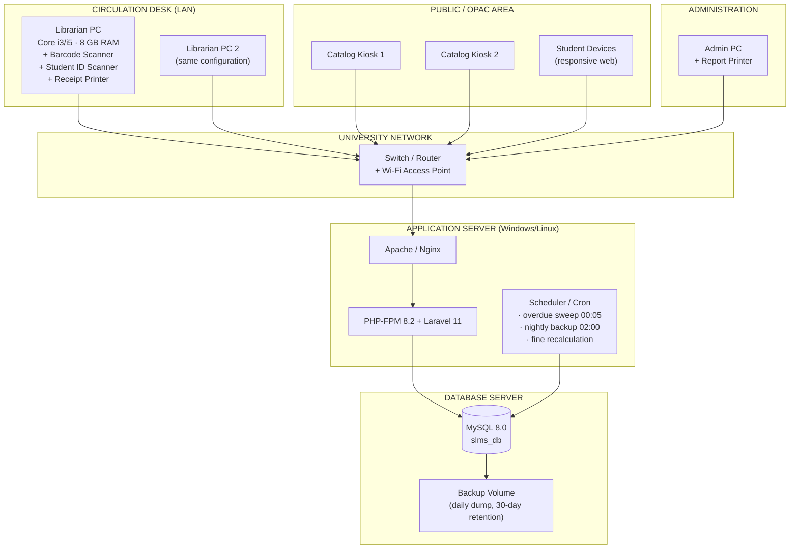

### 13.2 Environments

| Environment | Purpose | Data | Deploy Trigger |
|-------------|---------|------|----------------|
| **Local** | Developer workstation (VS Code) | Seeded fake data | Manual |
| **Testing** | QA & UAT | Anonymised sample data | Merge to `develop` |
| **Staging** | Pre-release rehearsal | Copy of production structure | Tag `rc-*` |
| **Production** | Live library | Real data | Tag `v*` + admin approval |

### 13.3 Backup & Recovery (Security Feasibility §2.10)

| Aspect | Policy |
|--------|--------|
| **Frequency** | Automated nightly full dump at 02:00; on-demand pre-upgrade dump |
| **Retention** | 30 daily · 12 weekly · 12 monthly |
| **Location** | Local backup volume + off-machine copy (external drive / network share) |
| **Verification** | Weekly automated restore test into the testing environment |
| **RPO** | ≤ 24 hours |
| **RTO** | ≤ 4 hours |
| **Access** | Admin role only; every backup/restore action logged |

---

## 14. Non-Functional Architecture

### 14.1 Performance Budget

| Operation | Target | Technique |
|-----------|--------|-----------|
| Book search (≤10k titles) | < 1.5 s | Indexes, pagination, 60 s cache, eager loading |
| Barcode scan → record lookup | < 300 ms | Unique index on `barcode` / `card_uid` |
| Issue transaction (end-to-end) | < 2 s | Single short transaction, minimal writes |
| Return + fine calculation | < 2 s | Pre-computed rate, no N+1 |
| Dashboard load | < 2 s | Cached aggregate counters (5 min TTL) |
| Report generation (1 month) | < 5 s | Indexed date ranges; async queue for large exports |
| Page render (server) | < 500 ms | Blade compilation cache, route/config cache |

### 14.2 Reliability Tactics

| Concern | Tactic |
|---------|--------|
| Double-issue of the same copy | `SELECT … FOR UPDATE` row lock inside the transaction |
| Partial writes on failure | `DB::transaction()` around every multi-table operation |
| Orphan records | Foreign keys with explicit `ON DELETE` policy |
| Counter drift (`available_copies`, `outstanding_fine`) | Nightly reconciliation job recomputes from source-of-truth tables |
| Scanner double-fire | Debounce in JS + idempotency guard on rapid duplicate barcode |
| Clock/date errors | All dates derived server-side; never trust client date |

### 14.3 Usability Tactics

- **Scanner-first design:** the barcode field auto-focuses and auto-submits on the scanner's trailing Enter, so the librarian never touches the mouse during a transaction.
- **Three-click rule:** any core task (search, issue, return, report) is reachable in ≤ 3 clicks from the dashboard.
- **Status colour system:** Available = green, Issued = amber, Overdue = red, Lost/Damaged = grey — consistent everywhere.
- **Confirmation for destructive actions** (delete book, waive fine, restore backup).
- **Inline validation** with field-level error messages, preserving submitted input.
- **Empty states** that explain what to do next rather than showing a blank table.

### 14.4 Scalability Path

| Stage | Trigger | Action |
|-------|---------|--------|
| 1 | Baseline | Single server, file cache |
| 2 | > 200 concurrent users | Add Redis for cache + sessions |
| 3 | Search latency > 2 s | MySQL FULLTEXT index; then dedicated search index |
| 4 | Report generation blocks requests | Move reports to a queued worker |
| 5 | Multi-branch library | Extract Catalog and Circulation into separate services behind the existing service interfaces |

---

## 15. Directory / Project Structure

```
smart-library-management-system/
├── app/
│   ├── Http/
│   │   ├── Controllers/
│   │   │   ├── AuthController.php
│   │   │   ├── DashboardController.php
│   │   │   ├── BookSearchController.php
│   │   │   ├── BookController.php
│   │   │   ├── BookCopyController.php
│   │   │   ├── CategoryController.php
│   │   │   ├── StudentController.php
│   │   │   ├── VerificationController.php
│   │   │   ├── CirculationController.php
│   │   │   ├── MyLibraryController.php
│   │   │   ├── FineController.php
│   │   │   ├── ReportController.php
│   │   │   └── Admin/
│   │   │       ├── UserController.php
│   │   │       ├── RoleController.php
│   │   │       ├── SettingController.php
│   │   │       ├── SystemLogController.php
│   │   │       └── BackupController.php
│   │   ├── Middleware/
│   │   │   ├── EnsureUserHasRole.php
│   │   │   ├── EnsureUserHasPermission.php
│   │   │   └── RecordAuditTrail.php
│   │   └── Requests/
│   │       ├── LoginRequest.php
│   │       ├── SearchBookRequest.php
│   │       ├── StoreBookRequest.php
│   │       ├── StoreStudentRequest.php
│   │       ├── IssueBookRequest.php
│   │       ├── ReturnBookRequest.php
│   │       └── CollectFineRequest.php
│   ├── Models/
│   │   ├── User.php  Role.php  Permission.php
│   │   ├── Student.php
│   │   ├── Book.php  BookCopy.php  Category.php
│   │   ├── Circulation.php  Fine.php
│   │   └── SystemSetting.php  SystemLog.php
│   ├── Services/
│   │   ├── Auth/          AuthenticationService.php  IdVerificationService.php
│   │   ├── Catalog/       BookCatalogService.php  BookSearchService.php
│   │   ├── Member/        StudentService.php
│   │   ├── Circulation/   BorrowService.php  ReturnService.php  RenewalService.php
│   │   ├── Fine/          FineCalculationService.php  FineSettlementService.php
│   │   ├── Report/        ReportingService.php  ExportService.php
│   │   └── System/        UserAccountService.php  SettingService.php
│   │                      AuditLogService.php  BackupService.php
│   ├── Repositories/
│   │   ├── Contracts/     *RepositoryInterface.php
│   │   ├── BookRepository.php  BookCopyRepository.php
│   │   ├── StudentRepository.php  CirculationRepository.php
│   │   ├── FineRepository.php  UserRepository.php
│   │   └── SystemLogRepository.php
│   ├── Policies/          BookPolicy.php  StudentPolicy.php
│   │                      CirculationPolicy.php  FinePolicy.php
│   ├── Exceptions/        CirculationException.php  VerificationException.php
│   ├── Console/Commands/  SweepOverdueLoans.php  RecalculateCounters.php
│   │                      RunNightlyBackup.php
│   └── Providers/         RepositoryServiceProvider.php  AuthServiceProvider.php
├── config/                app.php  database.php  library.php  auth.php
├── database/
│   ├── migrations/        (one per table, ordered by dependency)
│   ├── seeders/           RoleSeeder  PermissionSeeder  AdminUserSeeder
│   │                      CategorySeeder  SettingSeeder  DemoDataSeeder
│   └── factories/         BookFactory  StudentFactory  CirculationFactory
├── resources/
│   ├── views/             (see §5.3.1)
│   ├── css/app.css
│   └── js/  app.js  scanner.js  search.js
├── routes/                web.php  api.php  console.php
├── public/                index.php  css/  js/  images/  uploads/
├── storage/               app/backups/  app/reports/  logs/
├── tests/
│   ├── Unit/              FineCalculationTest  BorrowRuleTest  SearchServiceTest
│   └── Feature/           LoginTest  IssueBookTest  ReturnBookTest
│                          ReportAccessTest  RbacTest
├── docs/
│   ├── SYSTEM_ARCHITECTURE.md   ← this document
│   ├── DEVELOPMENT_PLAN.md
│   ├── DESIGN_PROMPT.txt
│   ├── erd.png  dfd-level0.png  dfd-level1.png  dfd-level2.png
│   └── api-collection.postman.json
├── .env.example
├── composer.json
├── package.json
└── README.md
```

---

## 16. Testing Architecture

| Level | Scope | Tooling | Representative Cases |
|-------|-------|---------|----------------------|
| **Unit** | Services in isolation (mocked repos) | PHPUnit / Pest | Fine = days × rate; grace period yields 0; cap applied; due date = issue + loan period; loan-limit rejection |
| **Integration** | Service + Repository + real DB | PHPUnit + SQLite/MySQL test DB | Issue writes circulation + flips copy status + increments counter, all atomically |
| **Feature (HTTP)** | Full request → response | Laravel HTTP tests | Student cannot open `/admin/users` (403); librarian can issue; invalid barcode returns 422 |
| **Security** | RBAC & injection | Feature tests + manual | Every route tested against every role; SQLi payloads in search; XSS in book title |
| **API** | JSON endpoints | Postman collection | Card verify, barcode lookup, suggest, availability |
| **Performance** | NFR budgets | Apache Bench / k6 | Search under 10k titles < 1.5 s; 50 concurrent circulation requests |
| **UAT** | Real workflows with librarians | Manual script | Issue → return on time; issue → return overdue → fine → collect; end-of-day report |

### 16.1 Critical Test Matrix — Fine Calculation (FR-05)

| Case | Due Date | Return Date | Rate | Grace | Expected |
|------|----------|-------------|------|-------|----------|
| On time | 2026-08-14 | 2026-08-14 | 5.00 | 0 | 0.00 |
| Early | 2026-08-14 | 2026-08-10 | 5.00 | 0 | 0.00 |
| 1 day late | 2026-08-14 | 2026-08-15 | 5.00 | 0 | 5.00 |
| 10 days late | 2026-08-14 | 2026-08-24 | 5.00 | 0 | 50.00 |
| Within grace | 2026-08-14 | 2026-08-16 | 5.00 | 2 | 0.00 |
| Beyond grace | 2026-08-14 | 2026-08-19 | 5.00 | 2 | 15.00 (3 chargeable days) |
| Cap reached | 2026-08-14 | 2027-02-14 | 5.00 | 0 | 500.00 (capped) |
| Not yet returned, overdue | 2026-08-14 | *(null, today 2026-08-20)* | 5.00 | 0 | 30.00 accrued |

---

## 17. Architectural Decision Record (ADR) Log

| ADR | Decision | Alternatives Considered | Rationale |
|-----|----------|------------------------|-----------|
| **ADR-01** | Layered MVC monolith | Microservices; serverless | Single-site library, 6-month schedule, 200k BDT budget, small team. Monolith is the only responsible fit. |
| **ADR-02** | PHP 8.2 / Laravel 11 | Django; Spring Boot | Report lists PHP first; lowest hosting cost in Bangladesh; batteries-included MVC + auth + ORM. |
| **ADR-03** | MySQL 8.0 | PostgreSQL; SQLite | Explicitly mandated in report §1.8; team familiarity; ubiquitous hosting. |
| **ADR-04** | ~~Server-rendered Blade, not an SPA~~ **SUPERSEDED by ADR-13** | React/Vue SPA | *Original rationale: faster to build, better on aging lab PCs, no separate API/auth complexity.* |
| **ADR-05** | Service layer between Controller and Model | Fat controllers; fat models | Business rules (eligibility, fines, limits) span multiple entities. Services keep them testable and single-sourced. |
| **ADR-06** | Repository abstraction | Direct Eloquent in services | Enables unit tests without a DB and satisfies the Scalability NFR (storage swappable). |
| **ADR-07** | Separate `book_copies` from `books` | One row per physical book | The library holds multiple copies per title. Separation makes availability counts and per-copy tracking correct. |
| **ADR-08** | Fine snapshots `rate_per_day` on the row | Always read current rate | Changing the policy rate must not retroactively alter historical fines. |
| **ADR-09** | Denormalised `available_copies`, `outstanding_fine` | Compute on every read | Meets the search/dashboard performance budget. Reconciled nightly to prevent drift. |
| **ADR-10** | Append-only `system_logs` | Mutable log table | Security Feasibility §2.10 requires an accountable, tamper-evident audit trail. |
| **ADR-11** | Policy values in `system_settings`, not code | Hard-coded constants | FR-09 requires the administrator to configure system settings without a redeploy. |
| **ADR-12** | Row-level `FOR UPDATE` lock on issue | Optimistic check only | Two librarians scanning the same copy simultaneously must not both succeed. |
| **ADR-13** | **React SPA client + Laravel REST API server** (supersedes ADR-04) | Blade server rendering | Client requirement. The View layer moves out of Laravel into React; Laravel becomes an API-only backend. Consequences: (a) the Service/Repository/Model layers are unchanged — all business rules stay server-side; (b) authentication becomes stateless bearer tokens rather than session cookies; (c) §5.3 "View Layer" is now realised as React components, and §11 becomes the sole client contract. |
| **ADR-14** | Sanctum personal access tokens, not session cookies | Sanctum SPA cookie mode; JWT | The client is served from a different origin during development and may be deployed as static files. Bearer tokens avoid CSRF/cookie-domain coupling. 12-hour expiry — longer than a library shift, short enough that a forgotten desk session cannot be reused. |
| **ADR-15** | Statuses stored as `VARCHAR`, validated in the app | MySQL `ENUM` | Adding a status value must never require `ALTER TABLE` on a live circulation table. Validity is enforced by `App\Support\Status` and the Form Requests. |
| **ADR-16** | Business-rule violations return HTTP **409 Conflict** | 400 or 422 for everything | Lets the client distinguish "the system is correctly refusing this" (loan limit reached) from "you typed something wrong" (422) — which are different messages to a librarian. |
| **ADR-17** | Accession numbers come from a locked counter row | `MAX()` over the table | Stays correct when copies are deleted, and avoids dialect-specific `SUBSTRING`/`CAST` SQL. |

---

## 18. Risks & Mitigations

| # | Risk | Likelihood | Impact | Mitigation |
|---|------|:----------:|:------:|------------|
| R-01 | Scanner hardware arrives late (procurement delay) | Medium | High | Build manual-entry fallback for every scan field from day one; scanners are an input optimisation, not a dependency |
| R-02 | Legacy lab PCs too slow for the UI | Medium | Medium | Lightweight server-rendered pages, no heavy JS framework, ≤200 KB JS budget |
| R-03 | Incomplete/dirty legacy book records | High | High | Build a CSV import tool with a validation report; dedicate 1 week to data cleansing before go-live |
| R-04 | Librarian resistance to the new workflow | Medium | High | UAT with actual librarians in week 14; the 1-week training block in the schedule; scanner-first design mirrors their physical workflow |
| R-05 | Fine policy changes mid-project | Medium | Low | All policy values are configurable settings, never constants (ADR-11) |
| R-06 | Concurrent-issue race condition | Low | High | `SELECT … FOR UPDATE` inside the circulation transaction (ADR-12) |
| R-07 | Data loss from hardware failure | Low | Critical | Nightly automated backup, off-machine copy, weekly restore verification |
| R-08 | Scope creep (online payment, mobile app, e-books) | High | Medium | Explicit out-of-scope list (§1.4); change requests go to a Phase-2 backlog |
| R-09 | Schedule slip in the 8-week development block | Medium | High | Module-by-module delivery with weekly demos; Circulation (the core) built first |
| R-10 | Weak passwords on shared desk accounts | Medium | High | Enforced password policy, forced rotation, per-librarian accounts (never shared), audit log attribution |

---

## Appendix A — Business Rules Register

| ID | Rule | Enforced In |
|----|------|-------------|
| BR-01 | Only students with `membership_status = active` may borrow | `BorrowService` |
| BR-02 | A student may hold at most `max_books_per_student` active loans | `BorrowService` |
| BR-03 | A student with `outstanding_fine > fine_block_threshold` cannot borrow | `BorrowService` |
| BR-04 | Only a copy with `status = available` can be issued | `BorrowService` (row-locked) |
| BR-05 | `due_date = issue_date + loan_period_days` | `BorrowService` |
| BR-06 | A return is only valid against an active `issued` circulation record | `ReturnService` |
| BR-07 | Fine = `max(0, overdue_days − grace_days) × rate_per_day`, capped at `fine_max_cap` | `FineCalculationService` |
| BR-08 | On return, copy status reverts to `available` and the student's loan counter decrements | `ReturnService` |
| BR-09 | Only an Administrator may waive a fine, and a reason is mandatory | `FinePolicy` + `FineSettlementService` |
| BR-10 | A book title with any non-withdrawn copy cannot be deleted | `BookCatalogService` |
| BR-11 | `isbn`, `accession_no`, `barcode`, `student_no`, and `card_uid` are globally unique | DB constraints + Form Requests |
| BR-12 | Every write operation must produce a `SystemLog` entry | `AuditLogService` |
| BR-13 | The last remaining active Administrator account cannot be deleted or disabled | `UserAccountService` |
| BR-14 | A loan may be renewed at most `max_renewals` times, and never while overdue | `RenewalService` |
| BR-15 | Reporting operations are strictly read-only | `ReportingService` (D3) |

---

## Appendix B — Report Catalogue (FR-08)

| Report | Audience | Parameters | Key Columns |
|--------|----------|------------|-------------|
| Daily Circulation | Librarian | date | Issue time, student, book, librarian, due date |
| Circulation Summary | Librarian, Admin | date range | Total issued, returned, active, overdue |
| Overdue Books | Librarian | as-of date | Student, contact, book, due date, days overdue, accrued fine |
| Fine Collection | Admin, Management | date range | Fines raised, collected, waived, outstanding |
| Book Inventory | Librarian, Admin | category, status | Title, ISBN, category, shelf, total/available copies |
| Most Borrowed Books | Management | date range, top N | Title, author, category, borrow count |
| Student Activity | Librarian | student, date range | Full borrowing history, fines, current loans |
| Department Usage | Management | date range | Department, active members, loans, avg. loan duration |
| System Audit | Admin | date range, action, user | Timestamp, user, action, entity, IP |

All reports render on screen, print via the `print` layout, and export to PDF and Excel.

---

**End of Software Architecture Document**
